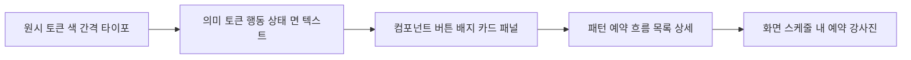
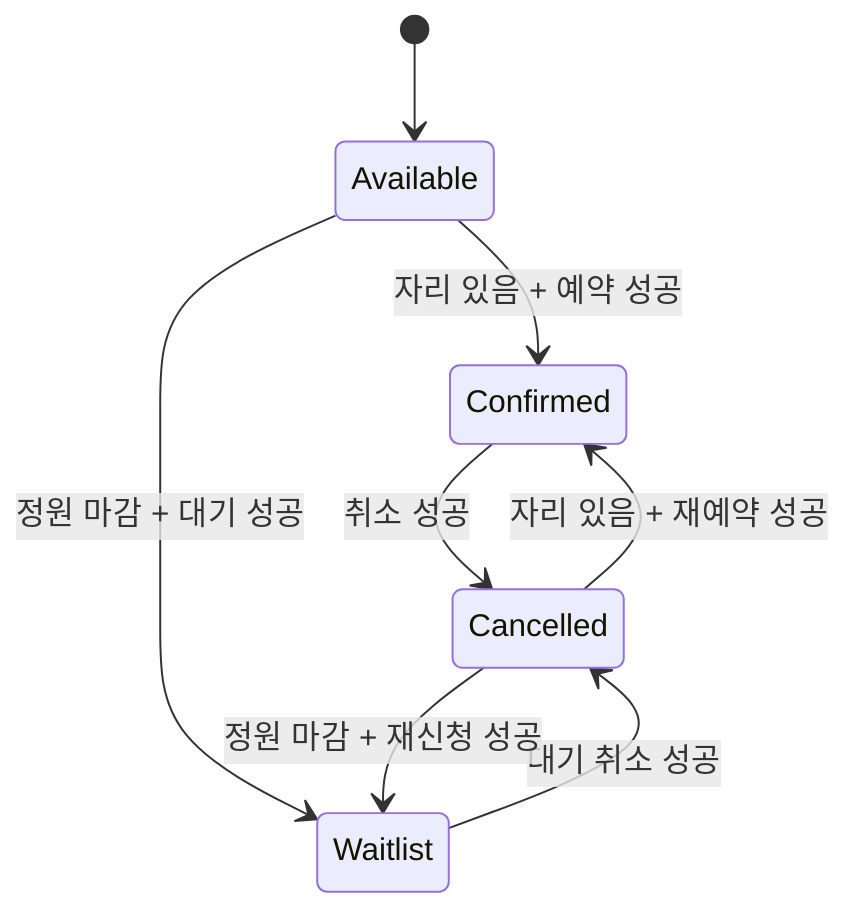

# DDoukD 디자인 시스템 설계

현재 `ddoukd-web`의 운동 클래스 예약 화면을 근거로, 보라·검정·노랑 포스터 스타일을 재사용 가능한 토큰과 컴포넌트 규칙으로 정리한 **v0.1 제안**입니다. 실제 UI 캡처 43개와 구현의 차이를 함께 기록했습니다. 프론트 코드에 적용된 디자인 시스템은 아직 없으며, 이 문서는 구현의 기준을 제안합니다.

문서 저장소의 MVP는 사업장 운영자 중심입니다. 이번 캡처는 회원이 클래스를 예약하는 프론트 프로토타입이므로 MVP 기능·권한·회원권 정책을 새로 확정하지 않습니다. 색·타이포·버튼·패널 같은 공통 기반은 재사용하고, 사업장 예약·회원 관리 화면은 별도로 설계해야 합니다. [MVP 범위](../mvp.md)와 [권한 설계](../spec/tenancy.md)가 제품 범위의 기준입니다.

[시각 갤러리](index.html) · [전체 캡처 목록](screenshots/README.md) · [토큰 제안](tokens.json) · [CSS 예시](tokens.css) · [색 대비 계산](contrast.json) · [프로토타입 API 명세](../spec/frontend-prototype-api.md)

## 근거와 캡처 조건

| 항목 | 기준 |
| --- | --- |
| 원본 | [ddoukd-web 2dd18e9](https://github.com/Team-DanD/ddoukd-web/tree/2dd18e9) |
| 색·테마 | [theme.css](https://github.com/Team-DanD/ddoukd-web/blob/2dd18e9/src/styles/theme.css) |
| 컴포넌트·상태·인라인 스타일 | [App.tsx](https://github.com/Team-DanD/ddoukd-web/blob/2dd18e9/src/app/App.tsx) |
| 폰트 | [fonts.css](https://github.com/Team-DanD/ddoukd-web/blob/2dd18e9/src/styles/fonts.css) |
| 고정된 오늘 | 2026-10-04, Asia/Seoul |
| 데스크톱 | 1440 × 1000, 전체 목록용 1440 × 1600 / 1350 |
| 반응형 | 390 × 844, 짧은 화면 390 × 640, 360 × 800, 768 × 1024 |
| 상태 생성 | 실제 예약·대기·취소·필터·상세·키보드 포커스 조작 |
| 보존 | 앱 데이터·스타일·사진을 바꾸지 않고 원본 화면 캡처 |

캡처의 박민준 이미지 로드 실패도 보존했습니다. 현재 `MY 예약`은 확정 레코드 3개를 초기화하고, 취소하면 레코드를 삭제하지 않습니다. 따라서 예약 없음 화면은 정상 조작으로 만들 수 없어 캡처하지 않았습니다. 로딩·서버 오류·진짜 disabled 버튼·다크 모드도 현재 동작하는 화면으로 검증하지 않았습니다. 이 상태는 아래에 **제안**으로만 정의합니다.

## 시각 방향

검정의 선과 각진 면이 구조를 만들고, 노랑은 선택과 주요 행동을 강조하며, 보라는 브랜드와 사진 처리에 사용합니다. 큰 제목과 숫자는 포스터의 리듬을 만들고, 예약 정보는 차분하고 읽기 쉬운 본문으로 유지합니다.

| 요소 | 현재 관찰 | 설계 원칙 |
| --- | --- | --- |
| 형태 | 앱 카드·버튼·아바타는 각진 형태 | 기본 radius 0. 예약 점 같은 원형 신호만 예외 |
| 테두리 | 2px 검정, 게이지·아바타 일부 1px | 구조는 2px, 미세 정보는 1px, 구분선은 낮은 대비 |
| 그림자 | 흐림 없이 3·4·5px 우하단 오프셋 | 행 3px, 주요 CTA 4px, 선택·강사 카드 5px |
| 사진 | grayscale + contrast 1.2 + 보라 multiply | 사진의 실제 내용이 보이도록 유지하고 실패 시 이름·대체 면 제공 |
| 장식 | Squiggle, HandRule, Burst, Sparkle, Cloud, Loop | 섹션당 1~2개. 의미·텍스트·포커스를 가리지 않도록 배치 |
| 색의 의미 | 강도와 예약 상태가 일부 다른 표현 사용 | 강도 배지와 예약 상태 배지를 독립된 타입으로 관리 |

## 토큰 구조



원시 색을 컴포넌트에서 직접 사용하지 않고 의미 토큰을 참조하도록 제안합니다. `tokens.json`은 단위와 상태를 포함한 프로젝트용 명세이며, `tokens.css`는 그 제안의 대응 예시입니다. 자동으로 앱에 로드되지 않습니다.

### 원시 색

아래 값은 모두 현재 테마에서 추출했습니다. 사용 규칙은 제안입니다.

| 토큰 | 값 | 사용 |
| --- | --- | --- |
| purple | `#7C3AED` | 브랜드, 대기 상태, 사진 듀오톤 |
| purpleDeep | `#5B21B6` | 옅은 보라 면의 텍스트 |
| purpleTint | `#F3EEFE` | 이미 예약한 행의 면 |
| yellow | `#FFE500` | 주요 CTA, 선택, 확정 배지 |
| yellowDeep | `#E6CE00` | 주요 CTA hover 제안 |
| ink | `#111111` | 본문, 구조선, 하드 섀도 |
| paper | `#FFFFFF` | 기본 면 |
| surface | `#F5F5F7` | 통계, 보조 면, 취소 행 |
| surface2 | `#EBEBEF` | 보조 버튼, 비활성 면 |
| inkSoft | `#5A5A66` | 본문 설명, 취소 상태 텍스트 |
| inkFaint | `#6E6E7A` | 흰 면의 보조 정보만 |
| rule | `rgba(17,17,17,0.14)` | 보조 구분선 |
| destructive | `#E23B2E` | 테마에 존재. 오류 아이콘·테두리 전용 제안 |

### 의미 색과 현재 구현의 차이

| 역할 | 제안 배경 / 글자 | 현재와의 관계 |
| --- | --- | --- |
| action.primary | yellow / ink | 실제 예약 CTA와 동일. `theme.css --primary`는 현재 purple이므로 적용 시 함께 정리 |
| action.secondary | paper / ink | 취소 CTA와 동일 |
| action.waitlist | surface2 / ink | 마감 시 대기 신청 CTA와 동일. disabled 의미로 사용하지 않음 |
| selection | yellow / ink | 날짜·선택 행의 현재 표현 유지 |
| booking.confirmed | yellow / ink | MY 예약과 동일. 스케줄의 보라 예약됨 배지를 노랑으로 통일 제안 |
| booking.waitlist | purple / paper | MY 예약과 동일. 스케줄의 검정 대기중 배지를 보라로 통일 제안 |
| booking.cancelled | surface2 / inkSoft | 현재 inkFaint + opacity 0.5를 읽을 수 있는 텍스트로 변경 제안 |
| intensity.low | surface / inkSoft | 현재와 동일 |
| intensity.mid | purpleTint / purpleDeep | 현재와 동일 |
| intensity.high | yellow / ink | 현재와 동일 |
| feedback.error | paper / ink, destructive 경계 | 실패 의미를 아이콘·문구로 보완. 빨간 배경의 작은 흰 글자 사용 금지 |

`reserved` 행의 보라 틴트는 개인의 예약이 있는 면이고, `confirmed` 배지의 노랑은 예약 상태입니다. 배지 문구를 항상 함께 표시해 색만으로 의미를 전달하지 않습니다. 고강도 노랑과 확정 노랑도 컴포넌트 타입과 문구로 구분합니다.

### 타이포그래피

현재 Latin 디스플레이는 Anton, 본문은 DM Sans입니다. 한국어는 해당 폰트의 글리프 범위 밖에서 시스템 폰트로 대체되므로 기기별 결과가 달라질 수 있습니다. 한국어 본문을 `Noto Sans KR`, Latin 본문을 DM Sans로 통일하는 것은 **추가 제안**이며 폰트 도입은 구현 단계에서 로딩 성능·라이선스·실제 렌더링을 확인합니다.

| 역할 | 현재 값 | v0.1 제안 |
| --- | --- | --- |
| poster | clamp(2.6rem, 11vw, 6rem), 줄높이 0.82, 자간 -0.04em | Latin 포스터 전용으로 유지. 한국어 제목에 적용하지 않음 |
| detailTitle | clamp(1.7rem, 3.4vw, 2.6rem), 줄높이 0.92 | Latin용 규칙 보존. 한국어 28~40px, 줄높이 1.2 |
| title | 행 16.8px, 강사 25.6px | 행 18px / 1.3, 강사 24px / 1.25 |
| time | 시 33.6px, 분 17.6px | 숫자 32px / 1, 분 18px / 1 |
| body | 12~14px 설명 | 기본 14px / 1.6, 긴 설명 16px / 1.6 |
| label | 배지 10px, 필터 11px | 최소 12px / 1.4, 한국어 자간 0 |
| caption | 10~12px | 12px / 1.4 |

초대형 배경 워드마크는 장식이며 읽어야 하는 정보로 취급하지 않습니다. 예약 시간·좌석 수에는 tabular-nums를 사용하고, 한국어 정보와 영어 포스터 글자의 줄높이를 분리합니다.

### 간격과 크기

4px 기반 `4 / 8 / 12 / 16 / 20 / 24 / 32 / 40 / 48 / 64` 간격을 제안합니다. 현재 6px 배지 간격, 10px 게이지 위 여백, 14px 헤더 세로 패딩도 있으므로 이 값들은 시각 균형을 위한 예외로 기록합니다.

| 역할 | 현재 | 제안 |
| --- | --- | --- |
| 화면 가로 여백 | 목록 16px, 헤더·필터 20px, 섹션 24px | 모바일 16px, 데스크톱 24px |
| 행 간격 | 12px | 유지 |
| 카드 내부 | 16px, 상세 20px | 16 / 20 / 24px로 구분 |
| 클래스 시간 열 | min-width 76px + accent 6px | 76px 유지. 좁은 화면에서는 CTA를 다음 줄로 옮길 수 있음 |
| 강조선 | 6px | 유지 |
| 버튼 | 날짜 이동 28px, 닫기 32px, 주 CTA 높이 60px | 실제 클릭 영역 최소 44px. 주 CTA 최소 48px |
| 아바타 | 20 / 36 / 40px | 이미지 크기는 유지하되 클릭 가능하면 44px 클릭 영역 확보 |
| 게이지 | 행 6px, 상세 10px | 유지. 폭은 0~100%로 제한 |

### 모션과 레이어

현재 전환은 150ms, 목록 폭·정원 게이지는 300ms, 사진 확대는 500ms입니다. success 피드백은 2000ms입니다. v0.1은 이 시간을 유지하되 `prefers-reduced-motion`에서는 이동·확대를 제거하고 색/문구 변경을 즉시 반영합니다.

레이어는 base 0, decoration 1, header 10, sheet 50, toast 60으로 제안합니다. 장식에는 `aria-hidden`과 `pointer-events: none`을 적용합니다. 그림자가 주변 카드나 포커스 링을 자르지 않도록 최소 6px의 여유를 둡니다.

## 컴포넌트 계약

아래 API는 구현 제안입니다. 현재 대부분의 UI는 `App.tsx` 내부에 있고 공통 Button·Badge·Card로 추출되지 않았습니다. `src/app/components/ui`의 shadcn 컴포넌트는 현재 예약 화면의 기준으로 사용하지 않았습니다.

| 컴포넌트 | 주요 속성 | 상태와 동작 | 캡처 |
| --- | --- | --- | --- |
| AppHeader | activeTab, confirmedCount, user | 탭 선택, 모바일 줄바꿈 방지 | [헤더](screenshots/components/header.png) |
| DateStrip | selectedDate, today, bookingDates, onChange | 오늘·선택·예약 점, 이전/다음 주 | [날짜](screenshots/components/date-strip.png) |
| ClassFilter | value, options, onChange | 단일 선택, 가로 스크롤, aria-pressed | [필터](screenshots/components/filter-bar.png) |
| Button | variant, size, loading, disabled | primary, secondary, waitlist, danger, icon | [주 CTA](screenshots/components/cta-primary.png) |
| IntensityBadge | level: low/mid/high | 정보 표시, 클릭 동작 없음 | [중강도](screenshots/components/intensity-mid.png) |
| BookingBadge | status: confirmed/waitlist/cancelled | 의미 색과 텍스트 고정 | [예약 행](screenshots/components/booking-row-confirmed.png) |
| ClassCard | class, bookingStatus, selected, pending | 상세 열기와 예약 행동을 별도 버튼으로 구성 | [기본 행](screenshots/components/class-available.png) |
| CapacityMeter | occupied, total, size | 숫자와 progressbar 값 함께 제공 | [게이지](screenshots/components/detail-capacity.png) |
| ClassDetail | class, remaining, bookingStatus, pending | 동일 콘텐츠를 패널/시트에 재사용 | [상세](screenshots/components/detail-panel.png) |
| DetailSheet | open, labelledBy, onClose | Esc/외부 클릭 닫기, 포커스 trap·복귀, 배경 inert | [시트](screenshots/components/bottom-sheet.png) |
| BookingSummary | confirmed, waitlist, cancelled | 상태별 카운트 | [통계](screenshots/components/booking-summary.png) |
| BookingRow | booking, class | 날짜·시간·강사·상태. 취소 기록도 읽을 수 있게 유지 | [취소 행](screenshots/components/booking-row-cancelled.png) |
| InstructorCard | instructor, imageState | 듀오톤, 이름, 소개, 태그, 평점, 경력 | [강사](screenshots/components/instructor-card.png) |
| FeedbackMessage | kind, message, retry | success/status live region, error alert | 현재 별도 구현 없음 |
| EmptyState | title, description, action | 빈 결과의 원인과 복구 행동 | 현재 빈 예약 화면은 초기 데이터 때문에 접근 불가 |

### 버튼 상태

| 상태 | 시각 제안 | 동작 |
| --- | --- | --- |
| default | variant에 따른 면, 검정 2px 테두리, 하드 섀도 | 키보드·포인터 활성 |
| hover | primary는 yellowDeep, secondary는 surface | 클릭 영역·크기는 유지 |
| pressed | 아래 2px 이동, 그림자 오프셋 감소 | 레이아웃 재배치 없음 |
| focus-visible | 보라 3px outline + 2px 밝은 offset | 색·그림자와 독립적으로 항상 보임 |
| loading | 스피너와 진행 문구, aria-busy | 중복 제출 방지, 버튼 폭 유지 |
| disabled | surface2 면, inkSoft 글자, 그림자 제거 | 실제 disabled 속성. 대기 신청에는 적용 금지 |
| success | 체크와 정확한 완료 문구, live region | 기존 자리 수·카운트를 결과와 동기화 |
| failure | 에러 문구와 재시도, 버튼 복구 | 데이터 유지 또는 롤백을 명확히 표시 |

### 예약 상태와 피드백



위 전이는 **캡처한 클라이언트 프로토타입** 기준입니다. 운영 상태(완료·노쇼 등)는 [lifecycle.md](../spec/lifecycle.md)의 도메인 결정에 따라 확장하며, 이 문서의 3상태만으로 서버 모델을 덮어쓰지 않습니다.

| 행동 | 제안 문구 | 현재 차이 |
| --- | --- | --- |
| 예약 성공 | 예약이 완료됐어요 | 현재 체크 + 완료 또는 예약 완료 |
| 대기 신청 성공 | 대기 신청이 완료됐어요 | 현재 상세가 예약 완료라고 표시함 |
| 확정 예약 취소 | 예약이 취소됐어요 | 현재 즉시 취소하며 별도 안내 없음 |
| 대기 취소 | 대기 신청이 취소됐어요 | 현재 예약 취소라는 공통 CTA 사용 |
| 예약 실패 | 예약하지 못했어요. 다시 시도해주세요 | 서버 연동 이후 추가 필요 |
| 정원 변경 | 자리가 마감됐어요. 대기 신청할 수 있어요 | 서버 응답에 맞춰 카드·상세를 함께 갱신 |

취소 확인 단계는 제품의 취소 정책이 정해진 뒤 적용합니다. 현재의 즉시 취소를 새로운 정책으로 바꾸지는 않습니다.

## 레이아웃과 반응형

| 너비 | 현재 | v0.1 제안 |
| --- | --- | --- |
| 360~639px | 한 줄 헤더가 압축돼 탭 문구 줄바꿈, 필터 가로 스크롤 | 헤더를 로고/사용자와 탭 2행으로 배치. 행의 긴 제목은 줄바꿈 허용 |
| 640~767px | 예약 수 표시, 상세는 바텀시트 | 헤더 2행 또는 충분한 폭 검증 후 1행 |
| 768~1023px | md에서 55/45 상세 분할 시작 | 상세는 시트/단일 패널 사용. 강사 그리드는 2열 유지 가능 |
| 1024px 이상 | 목록 55%, 상세 45% | 분할 시작을 1024px로 옮기는 제안. 목록 ≥520px, 상세 ≥360px 확보 |
| 큰 화면 | 목록 전체 폭, 예약 max-width 672px, 강사 896px | 예약 672px·강사 896px 유지. 스케줄 최대 1440px 중앙 배치 제안 |

모바일 시트는 현재 max-height 88%를 유지하되 safe-area 하단 여백, 독립 스크롤, sticky CTA를 추가하도록 제안합니다. 내부 스크롤을 쓰는 화면의 캡처는 전체 문서 screenshot으로 아래 내용이 자동 포함되지 않습니다. `schedule-desktop-complete`와 `instructors-desktop-complete`는 **높인 뷰포트**이며 일반 1000px 화면과 구분했습니다.

## 접근성과 실제 확인한 문제

일반 텍스트 대비 기준은 4.5:1이며 큰 텍스트의 예외 기준은 3:1입니다. [W3C 대비 설명](https://www.w3.org/WAI/WCAG22/Understanding/contrast-minimum.html) 클릭 타깃의 AA 최소는 예외 조건이 있는 24px이며, 본 설계는 모바일 사용성을 위해 44px를 제품 기준으로 제안합니다. [W3C 타깃 크기 설명](https://www.w3.org/WAI/WCAG22/Understanding/target-size-minimum)

아래 대비는 [계산 스크립트](scripts/contrast.cjs)로 sRGB 색의 상대 휘도를 계산했습니다. 이미지 위 텍스트, 폰트 렌더링, 모든 상태를 검사한 결과는 아니며 앱 전체의 접근성 통과를 의미하지 않습니다.

| 조합 | 대비 | 판단 |
| --- | --- | --- |
| ink / paper | 18.88:1 | 일반 텍스트 기준 충족 |
| ink / yellow | 14.80:1 | 주요 CTA 기준 충족 |
| paper / purple | 5.70:1 | 보라 배지 기준 충족 |
| purpleDeep / purpleTint | 7.90:1 | 중강도 배지 기준 충족 |
| inkFaint / surface2 | 4.23:1 | 작은 일반 텍스트 기준 미달 |
| 취소 배지 opacity 0.5, 흰 배경 합성 | 1.84:1 | 취소 기록도 읽을 수 있도록 opacity 제거 제안 |
| paper / destructive | 4.29:1 | 작은 흰 글자 사용 금지 제안 |

| 우선순위 | 확인한 문제 | 권장 변경 |
| --- | --- | --- |
| P0 | 취소 행 전체 opacity 0.5와 희미한 배지 글자 | opacity 제거, inkSoft 사용, 선·면·배지로 취소 구분 |
| P0 | 대기 신청 후 예약 완료로 표시 | bookingStatus에 따라 대기/확정 피드백 분리 |
| P0 | 모바일 dialog에 aria-modal은 있으나 포커스 trap·복귀·배경 inert 없음 | 기존 Radix Dialog 기반으로 시트 동작 구성 |
| P1 | div role=button 안에 예약 button 중첩, keydown의 버블링 여지 | 상세 버튼과 액션 버튼을 형제로 분리 |
| P1 | 360px 헤더 탭이 여러 줄로 나뉨 | 모바일 헤더 2행, 탭 nowrap |
| P1 | 날짜 이동 28px·닫기 32px, 필터의 작은 라벨 | 44px 클릭 영역, 정보 라벨 12px 이상 |
| P1 | 스케줄과 MY 예약의 상태 배지 색 불일치 | confirmed/yellow, waitlist/purple로 의미 토큰 통일 |
| P1 | 박민준 사진 로드 실패 | 동일 크기의 이니셜 대체 이미지, img onError |
| P2 | 테마 변수와 App.tsx 하드코딩 색이 공존 | 의미 토큰으로 합치고 한 소스를 참조 |
| P2 | html lang=en, 한국어 폰트 대체 의존 | lang=ko, 한국어 폰트 전략 검증 |
| P2 | .dark 변수는 있으나 앱은 라이트 색 상수 사용 | 라이트 우선 구현 후 별도 다크 검증 |

패널을 열면 접근 가능한 제목에 연결하고, 닫으면 열었던 버튼으로 포커스를 복귀합니다. 필터/날짜는 선택 상태를 프로그램적으로 전달합니다. 주요 완료 알림은 `role=status`로, 복구가 필요한 실패는 `role=alert`로 전달합니다. 사진 배경의 텍스트는 불투명한 읽기 면을 확보하고 실제 사진별로 대비를 확인합니다.

## 구현 순서와 완료 기준

1. **토큰과 의미 정리** — App.tsx 상수와 theme.css를 하나의 의미 토큰으로 통합하고 primary/상태 색 충돌을 해결합니다. 라이트 모드 전체 화면에서 기존 레이아웃과 사진 처리가 보존돼야 합니다.
2. **기초 컴포넌트** — Button, 두 종류 Badge, CapacityMeter, AvatarFallback을 추출합니다. 클릭 영역·키보드 포커스·색 대비와 loading/disabled를 검증합니다.
3. **예약 UI** — ClassCard, BookingRow, Summary, DetailSheet를 구성합니다. 상세/예약 버튼을 분리하고 정확한 피드백·시트 포커스·모바일 헤더를 검증합니다.
4. **연동 상태** — 실제 API와 맞춘 pending/error/empty를 추가합니다. 초기 데이터가 있는 프로토타입 캡처를 서버 동작 검증으로 취급하지 않습니다.
5. **회귀 기준** — 360 / 390 / 768 / 1024 / 1440px, 긴 한국어 제목, 0/최대 좌석, 이미지 실패, 키보드만으로 예약·닫기, reduced motion을 확인합니다. 다크 모드는 별도 단계입니다.

사용자 상태를 변경하는 새 기능이나 디자인 시스템 구현은 이 PR에 포함하지 않았습니다. 이번 PR의 결과물은 참고 캡처, 제안 명세, 시각 갤러리와 재현 스크립트입니다.

## 문서 보기와 캡처 재현

`index.html`은 캡처와 데이터를 내장한 정적 갤러리여서 로컬 파일로 열 수 있습니다. 분류·검색·이미지 확대를 지원합니다. GitHub는 HTML을 앱으로 실행하지 않으므로 GitHub에서는 이 문서와 [캡처 목록](screenshots/README.md)을 확인합니다.

캡처 스크립트에는 별도로 Playwright와 Chromium/Chrome이 필요합니다. `ddoukd-web`에서 `pnpm dev --host 127.0.0.1`을 실행하고 문서 저장소 루트에서 아래처럼 실행하세요. 현재 커밋의 소스 정보까지 기록하려면 `SOURCE_REPO_PATH`를 지정합니다. 미지정 시 revision은 null로 저장합니다.

```bash
SOURCE_REPO_PATH=/path/to/ddoukd-web \
PLAYWRIGHT_MODULE_PATH=/path/to/playwright \
CHROME_PATH=/path/to/chrome \
node design-system/scripts/capture.cjs
node design-system/scripts/contrast.cjs
node design-system/scripts/build-gallery.cjs
```

`CAPTURE_URL`로 개발 서버 주소를 바꿀 수 있습니다. CHROME_PATH를 생략하면 Playwright의 기본 Chromium을 사용합니다. 의존성을 앱에 추가하지 않았습니다.
