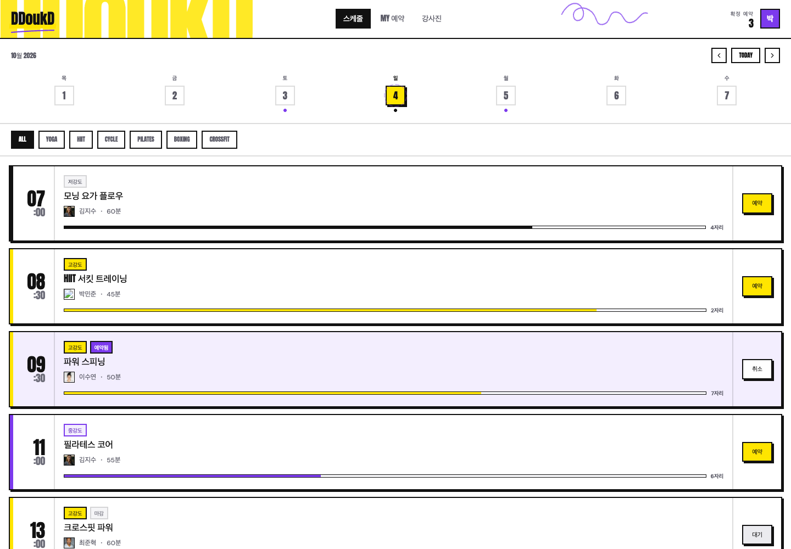
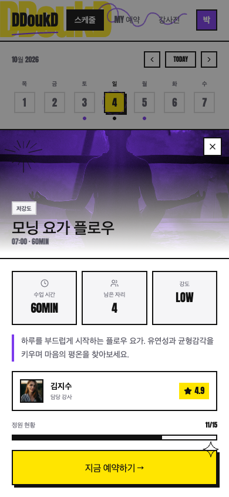
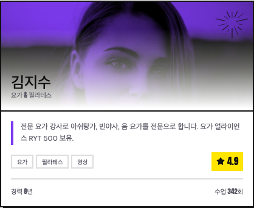

# 프론트 화면 캡처 목록

현재 프론트의 실제 화면 43개를 분류했습니다. 날짜는 2026-10-04로 고정했고 예약 상태는 UI 조작으로 생성했습니다. 캡처마다 원본 뷰포트·컴포넌트의 계산 스타일·실패 이미지를 [manifest.json](manifest.json)에 기록했습니다.

[설계안](../README.md) · [시각 갤러리](../index.html)

GitHub에서도 아래 PNG 링크를 열어 원본을 확인할 수 있습니다.

## 페이지

| 캡처 | 뷰포트 | 설명 |
| --- | --- | --- |
| [스케줄 데스크톱](pages/schedule-desktop.png) | 1440 × 1000 | 기본 뷰포트. 목록 아래 항목은 내부 스크롤로 확인합니다. |
| [스케줄 전체 목록](pages/schedule-desktop-complete.png) | 1440 × 1600 | 뷰포트를 높여 8개 클래스 전체를 캡처했습니다. |
| [클래스 상세 데스크톱](pages/detail-desktop.png) | 1440 × 1000 | 목록 55%와 상세 패널 45% 분할. |
| [내 예약 데스크톱](pages/bookings-desktop.png) | 1440 × 1000 | 포스터 제목과 상태별 통계, 날짜순 예약 목록. |
| [강사진 데스크톱](pages/instructors-desktop.png) | 1440 × 1000 | 2열 그리드, 포스터 타이틀, 듀오톤 강사 카드. |
| [강사진 전체 목록](pages/instructors-desktop-complete.png) | 1440 × 1350 | 뷰포트를 높여 강사 4명 전체를 캡처했습니다. |

## 컴포넌트

| 캡처 | 뷰포트 | 설명 |
| --- | --- | --- |
| [공통 헤더](components/header.png) | 1440 × 1000 | 워드마크, 포스터 타이포, 탭, 예약 수, 사용자 배지. |
| [주간 날짜 선택](components/date-strip.png) | 1440 × 1000 | 오늘, 선택일, 예약 점, 이전·다음 주. |
| [종목 필터](components/filter-bar.png) | 1440 × 1000 | ALL 선택 상태와 나머지 비선택 필터. |
| [예약 가능한 클래스](components/class-available.png) | 1440 × 1000 | 저강도 배지, 검정 강조선, 시간·강사·좌석·예약 CTA. |
| [이미 예약한 클래스](components/class-confirmed.png) | 1440 × 1000 | 보라 틴트 면, 예약됨 배지, 취소 CTA. |
| [정원 마감 클래스](components/class-full.png) | 1440 × 1000 | 마감 배지와 대기 신청 CTA. 대기는 활성 행동입니다. |
| [저강도 배지](components/intensity-low.png) | 1440 × 1000 | 회색 면과 회색 글자. |
| [중강도 배지](components/intensity-mid.png) | 1440 × 1000 | 보라 테두리와 옅은 보라 면. |
| [고강도 배지](components/intensity-high.png) | 1440 × 1000 | 노랑 면과 검정 글자. |
| [클래스 상세 패널](components/detail-panel.png) | 1440 × 1000 | 듀오톤 히어로, 통계, 설명, 강사, 정원, CTA. |
| [상세 히어로](components/detail-hero.png) | 1440 × 1000 | 16:9 사진, 보라 multiply, 밝은 그라디언트, 낙서. |
| [상세 통계 타일](components/detail-stats.png) | 1440 × 1000 | 시간·잔여 좌석·강도 3열. |
| [상세 정원 게이지](components/detail-capacity.png) | 1440 × 1000 | 예약 인원 / 전체 정원과 채워진 비율. |
| [주요 예약 버튼](components/cta-primary.png) | 1440 × 1000 | 노랑 배경, 검정 2px 테두리, 4px 하드 섀도. |
| [취소된 예약 행](components/booking-row-cancelled.png) | 1440 × 1000 | 취소 배지, 회색 면, 그림자 제거. |
| [예약 상태 요약](components/booking-summary.png) | 1440 × 1000 | 확정은 노랑, 대기는 보라, 취소는 회색. |
| [확정 예약 행](components/booking-row-confirmed.png) | 1440 × 1000 | 흰 면, 검정 그림자, 노랑 확정 배지. |
| [강사 카드](components/instructor-card.png) | 1440 × 1000 | 16:7 사진, 소개, 전문 분야, 평점, 경력, 수업 수. |
| [강사 태그와 평점](components/instructor-tags-rating.png) | 1440 × 1000 | 회색 테두리 태그와 노랑 평점. |
| [모바일 헤더](components/header-mobile.png) | 390 × 844 | 예약 수는 숨기고 워드마크·탭·사용자 배지를 유지합니다. |
| [모바일 바텀시트](components/bottom-sheet.png) | 390 × 844 | 현재 구현된 dialog. 히어로와 주요 내용을 캡처합니다. |

## 상태

| 캡처 | 뷰포트 | 설명 |
| --- | --- | --- |
| [상세 선택 상태](states/class-selected.png) | 1440 × 1000 | 선택한 행의 노랑 면과 5px 그림자. |
| [요가 필터 선택](states/filter-yoga.png) | 1440 × 1000 | 요가 2개만 노출하며 종목 필터를 검정으로 표시합니다. |
| [클래스 키보드 포커스 표시 누락](states/class-focus.png) | 1440 × 1000 | focus-visible은 활성화되지만 인라인 boxShadow가 Tailwind 링을 덮어 표시가 보이지 않습니다. 요소 경계 밖 8px도 포함했습니다. |
| [예약 완료 피드백](states/booking-success.png) | 1440 × 1000 | 2초간 체크와 완료 문구, 예약됨 배지, 잔여 좌석 감소. |
| [정원 마감 상세](states/detail-full.png) | 1440 × 1000 | FULL, 가득 찬 게이지, 대기 신청하기 CTA. |
| [대기 신청 직후](states/waitlist-feedback.png) | 1440 × 1000 | 실제 대기인데 현재 상세 CTA는 예약 완료라고 표시하는 문제를 기록합니다. |
| [대기 중 클래스](states/class-waitlist.png) | 1440 × 1000 | 검정 대기중 배지와 취소 CTA. |
| [예약 목록 대기 상태](states/bookings-waitlist.png) | 1440 × 1000 | 확정 3 / 대기 1 / 취소 0. |
| [예약 목록 취소 상태](states/bookings-cancelled.png) | 1440 × 1000 | 확정 2 / 대기 0 / 취소 1. 취소 행은 opacity 0.5. |

## 반응형

| 캡처 | 뷰포트 | 설명 |
| --- | --- | --- |
| [스케줄 모바일](responsive/schedule-mobile.png) | 390 × 844 | 390 × 844. 필터는 가로 스크롤, 목록은 세로 스크롤. |
| [상세 모바일 바텀시트](responsive/detail-mobile.png) | 390 × 844 | 최대 높이 88%, 어두운 스크림, 내부 스크롤. |
| [상세 모바일 하단](responsive/detail-mobile-actions.png) | 390 × 640 | 390 × 640의 짧은 화면에서 내부 스크롤 후 정원·CTA·설명이 보이는 상태. |
| [내 예약 모바일](responsive/bookings-mobile.png) | 390 × 844 | 390 × 844. 단일 열 예약 목록. |
| [강사진 모바일](responsive/instructors-mobile.png) | 390 × 844 | 390 × 844. 단일 열 카드. |
| [상세 태블릿 경계](responsive/detail-tablet.png) | 768 × 1024 | 768px에서 데스크톱 분할이 적용되어 목록 폭이 좁아집니다. |
| [좁은 모바일](responsive/schedule-small-mobile.png) | 360 × 800 | 360 × 800. 헤더와 행의 사용 가능 폭을 확인합니다. |

## 대표 화면

### 데스크톱 스케줄

### 모바일 상세

### 컴포넌트

## 캡처하지 않은 상태

예약 없음은 코드 분기가 있지만 초기 레코드를 UI에서 제거할 수 없어 정상 흐름으로 캡처하지 않았습니다. 로딩·서버 오류·다크 모드·진짜 disabled 버튼도 미구현 또는 미연결 상태입니다. 이 상태의 이미지를 만들어 실제 캡처로 분류하지 않았습니다.
