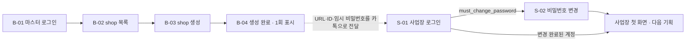

# 백오피스 + 사업장 인증

- 목적: 마스터가 shop을 만들어 사장에게 넘기고, 사장이 처음 들어와 비밀번호를 바꾸기까지의 화면을 정한다
- 근거 문서: [tenancy.md](../../spec/tenancy.md) 1~3·5·6절, [decisions.md](../../decisions.md) 2026-08-16(백오피스에서 shop 생성 / 로그인 화면: shop 고정),
  [components-operator.md](../../design-system/components-operator.md), [mvp.md](../../mvp.md)
- 상태: 초안 (화면 `.pen`은 아직 없음 — 디자인 시스템 운영자 컴포넌트가 main에 들어온 뒤 그린다)
- 화면 원본: `backoffice-staff-auth.pen` (예정). 컴포넌트는 [design-system/ddoukd.pen](../../design-system/ddoukd.pen)에서 가져온다

**셀프 회원가입 화면은 없다.** shop과 최초 OWNER는 마스터가 만들고(tenancy.md 1절), 회원은 로그인하지 않는다(6절).
2026-10-04 사용자 확인: 지금 스펙대로 진행.

## 흐름

## 화면

번호는 한 번 정하면 유지한다. `B-`는 백오피스(PC 1440 기준, 최소 1024), `S-`는 사업장(폰 390 기준).

| # | 화면 | 그룹 | 경로 | 메모 |
|---|------|------|------|------|
| B-01 | 마스터 로그인 | 백오피스 | `/backoffice/login` | 인증 레이아웃. email + 비밀번호. 실패 문구는 계정 존재 여부를 드러내지 않는 한 가지 |
| B-01e | 마스터 로그인 · 오류 | 백오피스 | 〃 | 폼 오류 요약 + 버튼 복구 |
| B-02 | shop 목록 | 백오피스 | `/backoffice/shops` | 백오피스 Shell. Table(샵 이름, shop-key, 생성일, 상태) + "shop 생성" 주 버튼 |
| B-02z | shop 목록 · 비어 있음 | 백오피스 | 〃 | EmptyState + shop 생성 유도 |
| B-03 | shop 생성 | 백오피스 | `/backoffice/shops/new` | Form: 샵 이름, shop-key(접두 `<도메인>/`), 타임존(기본 Asia/Seoul), OWNER 이름, OWNER email |
| B-03e | shop 생성 · 오류 | 백오피스 | 〃 | shop-key 형식 위반 / 예약어 / 이미 사용 중(409) 를 필드 오류로 |
| B-04 | shop 생성 완료 | 백오피스 | 생성 직후 | 읽기 전용 + 복사 필드 3개(URL, ID, 임시 비밀번호). "이 화면을 벗어나면 임시 비밀번호를 다시 볼 수 없다" 안내 |
| S-01 | 사업장 로그인 | 사업장 인증 | `/{shop-key}/login` | 인증 레이아웃. 위에 샵 이름. email + 비밀번호만 (샵 검색 없음) |
| S-01e | 사업장 로그인 · 오류 | 사업장 인증 | 〃 | 폼 오류 요약 |
| S-01n | 샵을 찾을 수 없음 | 사업장 인증 | 없는·비활성 shop-key | EmptyState. 다른 샵 존재 여부를 드러내지 않는다 |
| S-02 | 비밀번호 변경 (첫 로그인 강제) | 사업장 인증 | 로그인 직후 | 내비게이션 없는 인증 레이아웃. 현재(임시) 비밀번호 + 새 비밀번호. 끝내기 전에는 다른 화면으로 못 간다 |
| S-02e | 비밀번호 변경 · 오류 | 사업장 인증 | 〃 | 현재 비밀번호 불일치 / 새 비밀번호 규칙 위반 |

## 정책 (근거가 있는 것만)

- shop-key: 소문자 영숫자 + 하이픈, 3~30자, 하이픈 시작·종료·연속 불가, 숫자로만 구성 불가, 전역 unique, 발급 후 변경 불가, 예약어 금지 (tenancy.md 2절)
- shop 생성 시 최초 OWNER를 반드시 같이 만든다. 임시 비밀번호는 서버가 랜덤 생성하고 해시만 저장한다 — 완료 화면에서 한 번만 보인다 (tenancy.md 1절)
- 사업장 로그인은 URL의 shop-key로 샵이 고정된다. email + 비밀번호만 받는다 (decisions.md 2026-08-16)
- 임시 비밀번호 상태에서는 비밀번호 변경 외의 화면·API를 쓸 수 없다 (`must_change_password`, 서버는 403 `PASSWORD_CHANGE_REQUIRED`)
- 같은 사람이 여러 샵의 staff면 샵마다 별도 계정·별도 로그인이다. 샵 전환 UI는 없다 (tenancy.md 6절)
- 로그인 실패 문구는 한 가지: "이메일 또는 비밀번호가 올바르지 않습니다." (서버 `INVALID_CREDENTIALS`)

## 미결 사항

화면에서 임의로 확정하지 않는다. 그릴 때는 후보로 표시하고 결정되면 이 표와 근거 문서를 고친다.

| # | 항목 | 영향 화면 | 메모 |
|---|------|-----------|------|
| 1 | 임시 비밀번호 재발급 | B-02, (신규 화면) | tenancy.md 1절은 "백오피스에 재발급 버튼 필요". 서버 API는 아직 없다(server-nest PR #1 리뷰의 결정 필요 항목). 이번 기획에 버튼·확인창·결과 화면을 넣을지 |
| 2 | 비밀번호 규칙 | S-02 | 서버는 현재 8자 이상만 요구. 새 비밀번호 확인 입력을 받을지, 규칙 안내 문구 (components-operator.md 미결 2) |
| 3 | shop 상태 표시와 비활성화 | B-02 | 목록에 활성/비활성을 보여줄지, 백오피스에서 비활성화할 수 있는지 |
| 4 | shop 상세·수정 화면 | B-02 | 이름·타임존 수정 여부. shop-key는 변경 불가 |
| 5 | shop 목록의 검색·페이지 방식 | B-02 | components-operator.md 미결 9 |
| 6 | 세션 만료·다른 샵 토큰으로 접근했을 때의 화면 | S-01 | components-operator.md 미결 12 |
| 7 | 사업장 로그인 후 첫 화면 | S-02 이후 | 내비게이션 항목·순서 (components-operator.md 미결 11). 다음 기획(회원)에서 정한다 |
| 8 | 마스터 계정 생성·비밀번호 변경 화면 | B-01 | 현재는 서버 CLI(`admin:create`)로만 만든다. 화면이 필요한지 |
| 9 | 백오피스의 보라 헤더 | B-02~B-04 | components-operator.md의 디자인 확인 항목 |
| 10 | "로그인 유지", 비밀번호 찾기 | B-01, S-01 | 근거 문서에 없음. 넣지 않는 것을 기본으로 그린다 |
