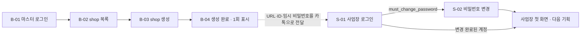

# 백오피스 + 사업장 인증

- 목적: 마스터가 shop을 만들어 사장에게 넘기고, 사장이 처음 들어와 비밀번호를 바꾸기까지의 화면을 정한다
- 근거 문서: [tenancy.md](../../spec/tenancy.md) 1~3·5·6절, [decisions.md](../../decisions.md) 2026-08-16(백오피스에서 shop 생성 / 로그인 화면: shop 고정),
  [components-operator.md](../../design-system/components-operator.md), [mvp.md](../../mvp.md)
- 상태: 초안 (2026-10-05 화면 12개를 `.pen`에 모두 그림. 리뷰 전이고 미결 14건이 남아 있다)
- 화면 원본: [backoffice-staff-auth.pen](backoffice-staff-auth.pen). [design-system/ddoukd.pen](../../design-system/ddoukd.pen)을 2026-10-04에 복사한 파일이라
  Foundations·Components·Operator Components·App Shells 프레임과 변수 193개가 함께 들어 있다. 화면 프레임은 그 아래에 있다 — `B-` 7개가 한 줄(y 6340), `S-` 5개가 그 아랫줄(y 7360).
  복사 이후 `ddoukd.pen`이 바뀌면 이 파일에는 자동으로 반영되지 않는다. 디자인 시스템 PR #12(테두리 패딩, 내비 라벨 굵기 등)까지는 2026-10-05에 손으로 반영했다

**셀프 회원가입 화면은 없다.** shop과 최초 OWNER는 마스터가 만들고(tenancy.md 1절), 회원은 로그인하지 않는다(6절).
2026-10-04 사용자 확인: 지금 스펙대로 진행.

## 흐름

## 화면

번호는 한 번 정하면 유지한다. `B-`는 백오피스(PC 1440 기준, 최소 1024), `S-`는 사업장(폰 390 기준).
`.pen`의 프레임 이름은 `<#> <화면>`이다(예: `B-01e 마스터 로그인 · 오류`, `S-02 비밀번호 변경 (첫 로그인 강제)`). 프레임 크기는 `B-` 1440 × 900, `S-` 390 × 844.

| # | 화면 | 그룹 | 경로 | 메모 |
|---|------|------|------|------|
| B-01 | 마스터 로그인 | 백오피스 | `/backoffice/login` | 인증 레이아웃. email + 비밀번호. 실패 문구는 계정 존재 여부를 드러내지 않는 한 가지 |
| B-01e | 마스터 로그인 · 오류 | 백오피스 | 〃 | 폼 오류 요약 + 버튼 복구. 입력 값은 유지 |
| B-02 | shop 목록 | 백오피스 | `/backoffice/shops` | 백오피스 Shell. Table(샵 이름, shop-key, 생성일, 상태) + "shop 생성" 주 버튼. 상태 열·검색·페이지·행 이동 화살표는 후보(아래 표) |
| B-02z | shop 목록 · 비어 있음 | 백오피스 | 〃 | EmptyState + shop 생성 유도 |
| B-03 | shop 생성 | 백오피스 | `/backoffice/shops/new` | Form: 샵 이름, shop-key(접두 `<도메인>/`), 타임존(기본 Asia/Seoul), OWNER 이름, OWNER email |
| B-03e | shop 생성 · 오류 | 백오피스 | 〃 | shop-key 형식 위반 / 예약어 / 이미 사용 중(409) 를 필드 오류로. 화면에는 "이미 사용 중" 한 가지만 그렸다 |
| B-04 | shop 생성 완료 | 백오피스 | 생성 직후 | 읽기 전용 + 복사 필드 3개(URL, ID, 임시 비밀번호). "이 화면을 벗어나면 임시 비밀번호를 다시 볼 수 없다" 안내. 복사 Toast 예시 포함 |
| S-01 | 사업장 로그인 | 사업장 인증 | `/{shop-key}/login` | 인증 레이아웃. 위에 샵 이름. email + 비밀번호만 (샵 검색 없음) |
| S-01e | 사업장 로그인 · 오류 | 사업장 인증 | 〃 | 폼 오류 요약. 입력 값은 유지 |
| S-01n | 샵을 찾을 수 없음 | 사업장 인증 | 없는·비활성 shop-key | EmptyState. 다른 샵 존재 여부를 드러내지 않는다 — 샵 이름·로고·행동 버튼 없이 문구만 |
| S-02 | 비밀번호 변경 (첫 로그인 강제) | 사업장 인증 | 로그인 직후 | 내비게이션 없는 인증 레이아웃. 현재(임시) 비밀번호 + 새 비밀번호. 끝내기 전에는 다른 화면으로 못 간다 |
| S-02e | 비밀번호 변경 · 오류 | 사업장 인증 | 〃 | 현재 비밀번호 불일치 / 새 비밀번호 규칙 위반. 둘 다 필드 오류로 한 화면에 그렸다 |

## 정책 (근거가 있는 것만)

- shop-key: 소문자 영숫자 + 하이픈, 3~30자, 하이픈 시작·종료·연속 불가, 숫자로만 구성 불가, 전역 unique, 발급 후 변경 불가, 예약어 금지 (tenancy.md 2절)
- shop 생성 시 최초 OWNER를 반드시 같이 만든다. 임시 비밀번호는 서버가 랜덤 생성하고 해시만 저장한다 — 완료 화면에서 한 번만 보인다 (tenancy.md 1절)
- 사업장 로그인은 URL의 shop-key로 샵이 고정된다. email + 비밀번호만 받는다 (decisions.md 2026-08-16)
- 임시 비밀번호 상태에서는 비밀번호 변경 외의 화면·API를 쓸 수 없다 (`must_change_password`, 서버는 403 `PASSWORD_CHANGE_REQUIRED`)
- 같은 사람이 여러 샵의 staff면 샵마다 별도 계정·별도 로그인이다. 샵 전환 UI는 없다 (tenancy.md 6절)
- 로그인 실패 문구는 한 가지: "이메일 또는 비밀번호가 올바르지 않습니다." (서버 `INVALID_CREDENTIALS`)

## 화면에 후보로 그린 것

확정이 아니다. 미결이 결정되면 화면을 고친다. 샵 이름·shop-key·email·날짜 같은 값은 전부 자리 채움용이다.

| 화면 | 후보로 그린 것 | 미결 # |
|------|----------------|--------|
| B-02 | 상태 열과 "활성" / "비활성" 배지. 비활성화 버튼은 그리지 않았다 | 3 |
| B-02 | 행 오른쪽 화살표(상세 화면으로 이동을 암시). 상세 화면은 그리지 않았다 | 4 |
| B-02 | 검색 필드(샵 이름 또는 shop-key), 번호형 Pagination | 5 |
| B-02 | 임시 비밀번호 재발급 버튼은 그리지 않았다 | 1 |
| B-02~B-04 | 보라 헤더, 사이드바 항목 "shop 목록" · "shop 생성" | 9 |
| B-01, S-01 | "로그인 유지", 비밀번호 찾기를 넣지 않았다 | 10 |
| B-03 | 폼 폭 560, OWNER 이름·이메일을 한 줄에 나란히 | 13 |
| B-03, B-03e, B-04 | 도움말·오류·안내 문구 전부 | 14 |
| S-01n | 문구 "페이지를 찾을 수 없어요 / 주소를 다시 확인해주세요" | 12 |
| S-02 | 새 비밀번호 확인 입력을 받지 않는다. 도움말 "8자 이상으로 입력해주세요"(서버의 현재 요구 사항) | 2 |
| S-02 | 로그아웃 등 나가는 수단을 두지 않았다 | 11 |
| S-02e | 오류 문구 "현재 비밀번호가 올바르지 않아요", "비밀번호가 너무 짧아요" | 2, 14 |

## 디자인 시스템에 없는 것

새 재사용 컴포넌트는 만들지 않았다. 아래는 이 파일 안에서 기존 컴포넌트를 override하거나 화면에 직접 조합한 것이다.
필요하다고 판단되면 [ddoukd.pen](../../design-system/ddoukd.pen)과 [components-operator.md](../../design-system/components-operator.md)에 올린다.

| 필요했던 것 | 이 파일에서 처리한 방법 | 쓰인 화면 |
|-------------|-------------------------|-----------|
| 비밀번호 필드의 오류 상태 | `TextField/Password` 인스턴스에 `feedback-error-*` 면·테두리·글자색 override. `FormField/Error`의 오류 줄(아이콘 16 + 문구)을 같은 수치로 직접 조합 | S-02e |
| 비밀번호 필드의 빈(placeholder) 상태 | `TextField/Password` 값에 placeholder 문구와 `text-caption-on-paper` override | B-01, S-01, S-02 |
| EmptyState "화면 전체: 찾을 수 없음" 변형 | `EmptyState/First`에 세로 패딩 64 override, 행동 버튼 숨김 | S-01n |
| 인증 상자 안의 제목 + 설명 묶음 | `text-title` 굵게 + `text-body` 보조색을 간격 8로 직접 조합 | S-02, S-02e |
| 경고 안내 상자(다시 볼 수 없음) | 노랑 면 + 검정 2px 테두리 + `triangle-alert` 아이콘을 직접 조합 | B-04 |
| PC 폼의 제출 영역(오른쪽 정렬, 버튼 2개) | 버튼 인스턴스를 직접 배치. pen에는 `Form/SubmitArea Mobile`만 있다 | B-03, B-03e, B-04 |
| 백오피스 사이드바의 "shop 생성" 선택 상태 | `AppShell/Backoffice Sidebar` 인스턴스에서 두 항목의 면·글자색을 서로 바꿔 override | B-03, B-03e, B-04 |
| PC 인증 화면 | `Shell/Auth 390`과 같은 상자를 폭 400으로 1440 화면 가운데에 배치 | B-01, B-01e |

## 미결 사항

화면에서 임의로 확정하지 않는다. 그릴 때는 후보로 표시하고 결정되면 이 표와 근거 문서를 고친다.
11~14는 2026-10-05 화면을 그리면서 생긴 것이다.

| # | 항목 | 영향 화면 | 메모 |
|---|------|-----------|------|
| 1 | 임시 비밀번호 재발급 | B-02, (신규 화면) | tenancy.md 1절은 "백오피스에 재발급 버튼 필요". 서버 API는 아직 없다(server-nest PR #1 리뷰의 결정 필요 항목). 이번 기획에 버튼·확인창·결과 화면을 넣을지 |
| 2 | 비밀번호 규칙 | S-02 | 서버는 현재 8자 이상만 요구. 새 비밀번호 확인 입력을 받을지, 규칙 안내 문구 (components-operator.md 미결 2) |
| 3 | shop 상태 표시와 비활성화 | B-02 | 목록에 활성/비활성을 보여줄지, 백오피스에서 비활성화할 수 있는지 |
| 4 | shop 상세·수정 화면 | B-02 | 이름·타임존 수정 여부. shop-key는 변경 불가 |
| 5 | shop 목록의 검색·페이지 방식 | B-02 | components-operator.md 미결 9 |
| 6 | 세션 만료·다른 샵 토큰으로 접근했을 때의 화면 | S-01 | components-operator.md 미결 12 |
| 7 | 사업장 로그인 후 첫 화면 | S-02 이후 | 내비게이션 항목·순서 (components-operator.md 미결 11). 다음 기획(회원)에서 정한다 |
| 8 | 마스터 계정 생성·비밀번호 변경 화면 | B-01 | 현재는 서버 CLI(`admin:create`)로만 만든다. 화면이 필요한지 |
| 9 | 백오피스의 보라 헤더 | B-02~B-04 | components-operator.md의 디자인 확인 항목 |
| 10 | "로그인 유지", 비밀번호 찾기 | B-01, S-01 | 근거 문서에 없음. 넣지 않는 것을 기본으로 그린다 |
| 11 | 비밀번호 변경 화면에서 나가는 수단과 변경 직후 동작 | S-02 | 다른 사람 기기에서 잘못 로그인했을 때 로그아웃할 방법이 필요한지. 변경 후 바로 첫 화면으로 갈지 다시 로그인시킬지, 완료 Toast를 띄울지 |
| 12 | 샵을 찾을 수 없음 화면의 문구와 구성 | S-01n | 서비스 로고를 보여줄지, 안내 문구. 없는 샵과 비활성 샵은 같은 화면이어야 한다(components-operator.md EmptyState) |
| 13 | PC 폼의 폭과 필드 배치 | B-03, B-03e, B-04 | 화면은 폭 560에 OWNER 이름·이메일을 나란히 그렸다. components-operator.md는 최대 480 한 열을 제안한다. 480 한 열로 바꾸면 B-03e가 1440 × 900에 다 들어가지 않는다 |
| 14 | 문구의 말투와 실제 문구 | 전 화면 | 로그인 실패는 서버 문구라 합니다체, 나머지 도움말·오류는 디자인 시스템 예시를 따라 해요체로 그렸다. shop-key 형식 위반·예약어 오류 문구는 아직 없다 |

## 그릴 때 확인한 것 (pencil MCP)

- 2026-10-05 B 화면 검토에서 고친 것: B-01 비밀번호 필드 placeholder 추가, B-02 상태 열 머리글의 "(미결)" 표기를 빼고 이 문서로 옮김·배지 문구를 "활성" / "비활성"으로 통일,
  B-03·B-03e 타임존 기본값이 placeholder 색으로 보이던 것을 본문 색으로, B-03·B-03e·B-04 사이드바 선택 항목의 아이콘·글자색이 면 색과 어긋나던 것
- 같은 세션에서 새로 만든 프레임(S 화면)은 `Get`의 잘림 검사(`problems`)와 좌표가 실제와 다르게 나왔다. 별도 호출로 검사해도 같았고, 스크린샷·PNG 내보내기로는 잘림이 없었다. 새 프레임은 이미지로 확인한다
