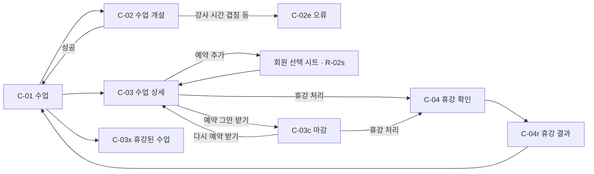

# 수업 (세션) 개설 · 공개 · 마감 · 휴강

- 목적: 사장·강사가 폰으로 수업을 미리 열고, 공개 캘린더에 올리고, 예약을 그만 받거나 휴강 처리하는 화면을 정한다. 이미 있는 수업에 예약을 넣는 길도 여기서 잇는다
- 근거 문서: [data-model.md](../../spec/data-model.md)(class_session, service, staff_availability, booking), [lifecycle.md](../../spec/lifecycle.md) 1·2·5절,
  [tenancy.md](../../spec/tenancy.md) 7·8절, [mvp.md](../../mvp.md), [components-operator.md](../../design-system/components-operator.md), [디자인 시스템](../../design-system/README.md)
- 짝이 되는 기획: `plans/member-booking/README.md`(회원 · 예약, PR #16). 그쪽의 미결 11("이미 있는 세션에 예약을 넣는 길")을 이 기획이 받는다
- 상태: 초안 (2026-10-06 화면 9개를 `.pen`에 그림. 리뷰 전이고 미결 15건이 남아 있다)
- 화면 원본: [class-session.pen](class-session.pen). [design-system/ddoukd.pen](../../design-system/ddoukd.pen)(장부 톤)을 복사한 파일이라
  Foundations·Components·Screens 프레임과 변수 105개가 함께 들어 있다. 화면 프레임 `C-` 9개는 그 아래 한 줄(y 2960)에 있다

## 먼저 풀어야 하는 것: 서비스와 강사는 누가 등록하나

수업을 열려면 서비스(`service`)와 강사(`staff`)가 있어야 한다. 예약 추가(R-02)도 마찬가지다. **이 둘을 등록하는 길은 확정되지 않았다.** 2026-10-06에 [서비스 · 강사 등록 초안](../../spec/service-staff-registration.md)([화면](../service-staff/README.md))이 사장이 "더보기"에서 직접 등록하는 안을 제안했고, 채택은 미정이다.

| 필요한 데이터 | 스펙에 있는 것 | 정해지지 않은 것 |
|---------------|----------------|------------------|
| 최초 사장 계정 | 백오피스에서 shop을 만들 때 OWNER를 함께 만든다 (tenancy.md 1절) | — |
| 다른 강사 | 권한 표는 OWNER가 staff를 만들 수 있다고 한다 (tenancy.md 8절) | 화면이 없다. 로그인하지 않는 강사(`password_hash` null)를 어떻게 넣는지 |
| 서비스 | 권한 표는 OWNER가 service를 만들 수 있다고 한다. 이름, 소요 시간, 정원, 기본 차감 횟수 (data-model.md service) | 화면이 없다. 샵을 만들 때 기본 서비스를 하나 넣어 주는지 |
| 강사 가용시간 | 요일 반복 가용시간이 있고 수업 개설 때 후보 시간을 제안·검증하는 기준이다 (data-model.md staff_availability) | 화면이 없다. 비어 있으면 수업 개설이 막히는지 |

이 기획은 "서비스와 강사가 이미 있다"는 전제로 그렸다. 등록 경로의 채택은 서현이 정해야 하고, 정해지기 전에는 이 기획의 화면을 실제로 쓸 수 없다(미결 1).
위 초안이 채택되면 C-02 · R-02의 서비스 · 강사 선택에 "새로 등록" 진입점(초안의 LK-01 · LK-03)을 이 기획에 합친다.

## 범위

들어가는 것

- 수업 목록(날짜별), 수업 개설, 수업 상세
- 공개와 비공개 전환, 예약 그만 받기(마감)와 다시 받기, 휴강 처리와 그 결과
- 수업 상세에서 그 수업에 예약을 넣는 길

들어가지 않는 것

- 그룹 수업의 운영 화면. 스키마는 정원을 담지만 지금은 1:1(정원 1)만 쓴다 (data-model.md 첫 슬라이스에서 뺀 것)
- 매주 반복되는 수업을 한 번에 여는 것(정기 수업). 같은 문서가 뺐다
- 대기자, 회원권 차감과 복구(회원권 트랙), 강사의 휴가 같은 예외 일정
- 공개 캘린더 화면 자체. 톤과 구성이 정해지지 않았다
- 서비스 · 강사 · 가용시간의 등록 화면(위 절)

## 흐름

## 화면

번호는 한 번 정하면 유지한다. `C-`는 수업이다. 모두 사업장 운영자 화면이고 폰 390 × 844 기준이다. `.pen`의 프레임 이름은 `<#> <화면>`이다.

| # | 화면 | 메모 |
|---|------|------|
| C-01 | 수업 | 7일 날짜 띠 + 그날의 수업 행(시각, 서비스, 강사 · 예약 수 / 정원, 상태 · 공개 배지). 주 버튼 "수업 개설" |
| C-01z | 수업 · 비어 있음 | 그날 수업이 없을 때 |
| C-02 | 수업 개설 | 서비스, 강사, 날짜, 시작 시각, 종료 시각(읽기 전용), 정원(읽기 전용), 공개 여부 체크 |
| C-02e | 수업 개설 · 오류 | 폼 맨 위 오류 요약. 입력 값은 유지 |
| C-03 | 수업 상세 | 일시, 서비스 · 강사, 상태 배지, 공개 스위치, 예약한 회원, 수업 관리(예약 그만 받기, 휴강 처리). 주 버튼 "예약 추가" |
| C-03c | 수업 상세 · 마감 | 예약을 그만 받는 상태. "다시 예약 받기"와 휴강 처리. 예약 추가 버튼 없음 |
| C-03x | 수업 상세 · 휴강 | 종착 상태. 행동 없음. 취소된 예약의 회원을 그대로 보여준다 |
| C-04 | 휴강 확인 | 확인 시트. 함께 취소되는 예약 건수와 되돌릴 수 없다는 안내 |
| C-04r | 휴강 결과 | 취소된 예약의 회원 명단(이름, 전화번호). 직접 연락하라는 안내 |

## 정책 (근거가 있는 것만)

수업의 상태

- 상태는 `OPEN`, `CLOSED`, `CANCELLED` 셋이다. `OPEN`과 `CLOSED`는 서로 오갈 수 있고, 둘 다 `CANCELLED`로 갈 수 있다. `CANCELLED`는 종착이고 되살리지 않는다. 잘못 취소했으면 새 수업을 만든다 (lifecycle.md 1절)
- 공개 여부(`is_public`)는 상태와 별개의 축이다. `OPEN`이면서 비공개일 수 있다. 예약을 잡다가 즉석으로 만든 수업은 항상 비공개다 (lifecycle.md 1절)
- **정원이 찬 것은 상태가 아니다.** 꽉 차도 상태는 `OPEN`이다. `CLOSED`는 사장이 명시적으로 닫았을 때만이다 (lifecycle.md 1절)
- 수업은 지우지 않는다. 지난 예약의 이력이 수업에서 시각과 강사를 읽는다 (lifecycle.md 1절)

수업 개설

- 종료 시각은 서비스의 소요 시간으로 채운다. 정원은 개설 시점의 서비스 정원을 복사한다 (data-model.md class_session)
- 같은 강사의 시간이 겹치는 수업은 만들 수 없다. 앱에서 검사한다 (data-model.md class_session)
- 강사의 요일별 가용시간이 수업 개설의 후보 시간 제안과 검증의 기준이다 (data-model.md staff_availability)
- 날짜와 시각은 샵의 타임존 기준이다 (data-model.md staff_availability)

휴강

- 휴강 처리하면 그 수업에 붙은 `BOOKED` 예약이 **전부 함께 취소**된다. 이미 `CANCELLED` · `NO_SHOW`인 예약은 대상이 아니다. `booked_count`는 0으로 돌린다. 한 트랜잭션이다 (lifecycle.md 5절)
- 서버는 취소된 예약 건수와 **영향받은 회원 명단**을 돌려준다. 사장이 그 명단으로 연락해야 하기 때문이다. 자동 알림은 지금 없다 (lifecycle.md 5절)

예약과의 관계

- 예약은 수업에 붙는다. 지난 수업, 닫힌 수업, 정원이 찬 수업에는 예약할 수 없다 (lifecycle.md 4절)
- 예약을 취소하면 자리가 돌아온다. 수업은 그대로 남는다 (lifecycle.md 2절)

공개 캘린더에 나가는 것

- 공개된(`is_public = true`) `OPEN`과 `CLOSED` 수업만 나간다. 나가는 것은 수업명, 시작·종료 시각, 강사 표시명, 잔여 정원과 마감 여부다. 회원 이름과 예약 여부는 어떤 형태로도 나가지 않는다 (tenancy.md 7절)

## 상태별 표시와 행동

| 상태 | 공개 | 화면의 배지 | C-03에서 할 수 있는 것 |
|------|------|-------------|------------------------|
| `OPEN` | 공개 | 예약 가능 · 공개 | 예약 추가(자리가 있을 때), 공개 끄기, 예약 그만 받기, 휴강 처리 |
| `OPEN` | 비공개 | 예약 가능 · 비공개 | 위와 같고 공개 켜기 |
| `CLOSED` | 둘 다 | 마감 · (공개 / 비공개) | 다시 예약 받기, 공개 전환, 휴강 처리. 예약 추가는 없다 |
| `CANCELLED` | — | 휴강 | 없다 |

- 정원이 찬 `OPEN` 수업은 배지가 "예약 가능"인 채로 예약 추가 버튼만 사라진다. 이때 배지 문구를 어떻게 할지는 미결 9다
- 시작 시각이 지난 수업에서 무엇을 할 수 있는지는 정해지지 않았다(미결 10). 서버는 지난 수업에 예약을 막는다는 것만 확정이다

## 이미 있는 수업에 예약 넣기

`plans/member-booking`의 예약 추가(R-02)는 강사 · 서비스 · 날짜 · 시각을 입력해 **새 수업을 즉석으로 만드는 길**만 그렸다. 이 기획이 나머지 길을 잇는다.

| 경우 | 이 기획에서의 길 | 정해지지 않은 것 |
|------|------------------|------------------|
| 미리 열어 둔 수업에 예약 | C-01 → C-03 → "예약 추가" → 회원 선택 시트(R-02s) → C-03 | 예약 추가(R-02) 화면에서도 기존 수업을 고를 수 있게 할지(미결 6) |
| 예약이 취소돼 비어 있는 즉석 수업에 다시 예약 | 그 수업도 C-01에 보인다(비공개). C-03 → "예약 추가" | 같은 시간에 R-02로 새 수업을 만들려 하면 강사 시간 겹침에 걸린다. 그때 기존 수업을 자동으로 다시 쓸지, 안내만 할지(미결 7) |
| 취소했던 회원을 같은 수업에 다시 예약 | 위와 같다. 취소된 예약은 중복 검사에서 빠진다 (data-model.md booking) | — |

비어 있는 즉석 수업이 C-01에 계속 쌓이는 문제가 있다. 예약이 없고 비공개인 수업을 목록에서 어떻게 보여줄지는 미결 8이다.

## 화면에 후보로 그린 것

확정이 아니다. 미결이 결정되면 화면을 고친다. 강사, 서비스, 회원, 날짜는 전부 자리 채움용이다.

| 화면 | 후보로 그린 것 | 미결 # |
|------|----------------|--------|
| C-01 | 하단 내비게이션의 "수업" 항목. `plans/member-booking`과 같은 후보다 | 2 |
| C-01 | 즉석으로 만든 비공개 수업도 같은 목록에 보여준다 | 8 |
| C-01 | 강사 구분 없이 샵 전체의 수업을 한 목록에 | 3 |
| C-01 | 행에 "예약 1 / 1"처럼 숫자로 정원을 보여준다. 꽉 찬 수업에 별도 표시는 없다 | 9 |
| C-02 | 정원을 읽기 전용 "1명"으로. 그날만 정원을 줄이는 입력은 그리지 않았다 | 4 |
| C-02 | 시작 시각을 Select로. 강사 가용시간에 맞는 시각만 보여주는지는 그리지 않았다 | 5 |
| C-02 | 공개 여부를 체크박스로, 기본값은 켜짐 | 11 |
| C-02e | 오류 문구 "그 시간에 박선생 님의 다른 수업이 있어요. 시각을 바꿔주세요" | 15 |
| C-03 | 공개 전환을 스위치로(누르는 즉시 반영) | 11 |
| C-03 | "예약 그만 받기" / "다시 예약 받기"라는 문구. 배지는 "마감" | 12 |
| C-03 | 수업의 일시 · 서비스 · 강사를 고치는 길을 그리지 않았다 | 13 |
| C-04 | 실행 버튼을 위에, 그만두기를 아래에. 건수는 "예약 1건" | — |
| C-04r | 결과를 화면 하나로 보여주고 "수업 목록으로" 돌아간다. 전화번호를 눌러 전화나 문자를 여는 동작은 그리지 않았다 | 14 |

## 디자인 시스템에 없는 것

새 재사용 컴포넌트는 만들지 않았다. 이 파일 안에서 직접 조합했다.

| 필요했던 것 | 이 파일에서 처리한 방법 | 쓰인 화면 |
|-------------|-------------------------|-----------|
| 수업 행(배지가 두 개까지 붙는 행) | 시각 + 서비스 · 보조 정보 + 배지 묶음을 `BookingRow`와 같은 수치로 직접 조합. `BookingRow`는 배지가 하나뿐이다 | C-01 |
| 상세의 머리(일시, 서비스 · 강사, 배지) | `title` + `body` 보조색 + 배지 묶음을 직접 조합 | C-03, C-03c, C-03x |
| 스위치가 있는 설정 줄 | `Switch` 인스턴스 + 도움말을 구획 안에 배치 | C-03, C-03c |
| 예약한 회원 행(오른쪽에 배지) | 이름 · 전화번호 + 배지를 직접 조합. `MemberRow`의 오른쪽은 회원권 정보 자리다 | C-03c, C-03x |
| 본문 안의 보조 · 위험 버튼 묶음 | `Button/Secondary`, `Button/Danger` 인스턴스를 구획 안에 세로로 배치 | C-03, C-03c |
| 폼 오류 요약 | 빨간 1px 테두리 상자 + 아이콘 + 문구를 직접 조합 | C-02e |

수업 행과 "오른쪽에 배지가 붙는 회원 행"은 `plans/member-booking`에서 직접 조합한 것(회원 선택 시트, 예약 상세 시트, 폼 오류 요약)과 함께 디자인 시스템에 올릴 후보다.

## 미결 사항

화면에서 임의로 확정하지 않는다. 그릴 때는 후보로 표시하고 결정되면 이 표와 근거 문서를 고친다.

| # | 항목 | 누가 | 영향 화면 | 메모 |
|---|------|------|-----------|------|
| 1 | 서비스 · 강사 · 가용시간을 누가 어디서 등록하는가 | 서현 | 전 화면 | 위 "먼저 풀어야 하는 것". [등록 초안](../../spec/service-staff-registration.md)이 제안됨, 채택 미정. 정해지기 전에는 수업 개설과 예약 추가를 쓸 수 없다 (components-operator.md 미결 13) |
| 2 | 하단 내비게이션의 항목 · 순서 · 첫 화면 | 서현 · 민수 | C-01 | `plans/member-booking` 미결 1과 같다 |
| 3 | 강사별로 걸러 볼지 | 서현 · 민수 | C-01 | `plans/member-booking` 미결 10과 같다. 권한 분기와는 별개다 |
| 4 | 그날만 정원을 바꾸는 입력 | 서현 | C-02 | 스키마는 수업마다 정원을 따로 갖는다. 지금은 1:1만 쓰므로 그리지 않았다 |
| 5 | 시각 입력 단위, 가용시간 밖 시각의 처리 | 서현 | C-02 | 5 · 10 · 30분 단위. 가용시간 밖을 막을지 경고만 할지 (components-operator.md 미결 5) |
| 6 | 예약 추가(R-02)에서 기존 수업을 고르게 할지 | 서현 · 민수 | R-02 | 수업 상세에서 넣는 길과 중복이다. 예약에서 출발하는 흐름이 더 자주 쓰이면 필요하다 |
| 7 | 같은 시간에 비어 있는 수업이 있을 때 즉석 생성의 처리 | 서현 | R-02, R-02e | 자동으로 그 수업을 다시 쓸지, 겹침 오류와 함께 그 수업으로 안내할지. 스펙에 없다 |
| 8 | 예약이 없는 비공개 즉석 수업을 목록에서 어떻게 보여줄지 | 서현 · 민수 | C-01 | 그대로 보이면 목록이 지저분해지고, 숨기면 다시 예약할 길이 없어진다. 자동으로 휴강 처리할지도 포함 |
| 9 | 정원이 찬 수업의 표시 | 민수 | C-01, C-03 | 상태는 `OPEN`이라 배지는 "예약 가능"이다. "마감"은 사장이 닫았을 때만 쓴다. 꽉 찼다는 것을 숫자만으로 전할지 |
| 10 | 지난 수업에서 할 수 있는 것 | 서현 | C-01, C-03 | 지난 수업의 공개 전환, 마감, 휴강을 허용할지. 지난 날짜로 수업을 개설할 수 있는지 (components-operator.md 미결 5) |
| 11 | 공개 전환을 즉시 반영할지, 개설 때의 기본값 | 서현 · 민수 | C-02, C-03 | components-operator.md 미결 8. 실수로 공개했을 때의 영향 |
| 12 | 마감의 문구 | 민수 | C-03, C-03c | "마감"이 정원이 찬 것과 헷갈릴 수 있다. "예약 그만 받기"로 그렸다 |
| 13 | 수업의 일시 · 서비스 · 강사 수정 | 서현 | C-03 | 예약이 붙은 수업의 시각을 바꾸면 회원에게 영향이 간다. 수정 대신 휴강 후 새로 개설하게 할지 |
| 14 | 휴강 결과에서 연락을 돕는 동작 | 민수 | C-04r | 전화번호를 눌러 전화 · 문자 열기, 명단 복사. 자동 알림은 나중 단계다 |
| 15 | 서버 오류 응답 형식과 문구 | 서현 | C-02e | components-operator.md 미결 10. 강사 겹침 외의 오류(가용시간 밖, 지난 시각) 문구 |

## 그릴 때 확인한 것 (pencil MCP)

- 2026-10-06 화면 9개를 모두 스크린샷으로 확인했다
- 같은 세션에서 새로 만든 프레임은 잘림 검사(`problems`)가 실제와 다르게 "잘림"을 보고했다. 스크린샷에는 잘림이 없었다. `plans/backoffice-staff-auth`에서도 같은 현상이 있었다
- 자리 채움용 데이터는 1:1 수업으로만 채웠다
