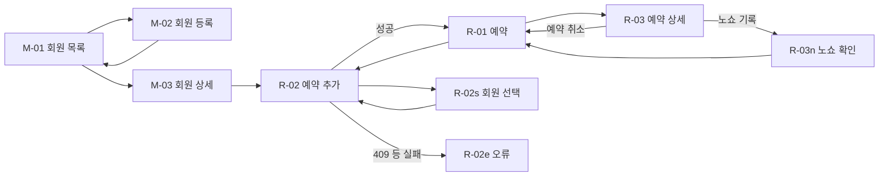

# 회원 + 예약 (사업장 운영자 화면)

- 목적: 사장·강사가 폰으로 회원을 등록하고, 예약을 잡고, 취소와 노쇼를 기록하는 화면을 정한다
- 근거 문서: [data-model.md](../../spec/data-model.md)(member, class_session, booking, 슬라이스 구분), [lifecycle.md](../../spec/lifecycle.md) 1~5절,
  [tenancy.md](../../spec/tenancy.md), [mvp.md](../../mvp.md), [components-operator.md](../../design-system/components-operator.md), [디자인 시스템](../../design-system/README.md)
- 상태: 초안 (2026-10-06 화면 12개를 `.pen`에 그림. 리뷰 전이고 미결 16건이 남아 있다)
- 화면 원본: [member-booking.pen](member-booking.pen). [design-system/ddoukd.pen](../../design-system/ddoukd.pen)(장부 톤, 2026-10-05)을 복사한 파일이라
  Foundations·Components·Screens 프레임과 변수 105개가 함께 들어 있다. 화면 프레임은 그 아래 한 줄(y 2960)에 `M-` 5개, `R-` 7개 순서로 있다.
  복사 이후 `ddoukd.pen`이 바뀌면 이 파일에는 자동으로 반영되지 않는다

## 범위: 슬라이스 1만 그렸다

지금 구현하는 슬라이스 1에는 **회원권이 없다**([data-model.md](../../spec/data-model.md) 구현 슬라이스 구분). 모든 예약은 "회원권 없는 예약"이고 차감이 없다.
그래서 이 기획의 화면에는 회원권 종류, 잔여 횟수, 만료일이 나오지 않는다.

- 디자인 시스템의 시안 화면(`Screens` 프레임의 회원 목록, 회원 등록, 오늘 예약)에는 "10회권 · 잔여 3회", "만료 D-5", 회원권 선택이 들어 있다.
  그것은 **회원권 트랙이 붙었을 때의 모습**이고 이 기획의 범위가 아니다
- 회원권 트랙이 붙으면 회원 목록의 오른쪽 열, 회원 등록의 회원권 선택, 예약 행의 잔여 표시, 예약 추가의 회원권 선택과 잔여 검증이 추가된다.
  그때 이 기획을 이어서 고친다
- 슬라이스 1만으로는 파일럿에 투입할 수 없다(수기 차감이 핵심 페인이기 때문). 이 화면들은 기반 단계의 화면이다

수업(세션)을 미리 개설하고 공개·마감·휴강하는 화면, 공개 캘린더, 서비스·강사·가용시간 관리 화면은 이 기획에 없다. 따로 기획한다.

## 흐름

## 화면

번호는 한 번 정하면 유지한다. `M-`은 회원, `R-`은 예약이다. 모두 사업장 운영자 화면이고 폰 390 × 844 기준이다.
`.pen`의 프레임 이름은 `<#> <화면>`이다(예: `M-02e 회원 등록 · 오류`).

| # | 화면 | 그룹 | 메모 |
|---|------|------|------|
| M-01 | 회원 목록 | 회원 | 검색 필드 + 행(이름, 전화번호). 주 버튼 "회원 등록"은 하단 고정 바 |
| M-01z | 회원 목록 · 비어 있음 | 회원 | 안내 문구만. 버튼은 하단 고정 바의 "회원 등록" 하나 |
| M-02 | 회원 등록 | 회원 | 이름, 전화번호, 메모(선택). 하단에 그만두기 / 저장 |
| M-02e | 회원 등록 · 오류 | 회원 | 같은 샵에 이미 있는 전화번호. 필드 오류로 표시. 입력 값은 유지 |
| M-03 | 회원 상세 | 회원 | 이름, 전화번호, 메모(편집 + 메모 저장), 예약 이력. 주 버튼 "예약 추가" |
| R-01 | 예약 | 예약 | 7일 날짜 띠 + 그날의 예약 행(시각, 회원, 강사 · 서비스, 상태). 진행 중인 행만 옅은 보라 면 |
| R-01z | 예약 · 비어 있음 | 예약 | 그날 예약이 없을 때 |
| R-02 | 예약 추가 | 예약 | 회원, 강사, 서비스, 날짜, 시작 시각. 종료 시각은 계산해서 읽기 전용 |
| R-02s | 예약 추가 · 회원 선택 | 예약 | 하단 시트. 검색 필드 + 회원 행 |
| R-02e | 예약 추가 · 오류 | 예약 | 폼 맨 위 오류 요약. 입력 값은 유지 |
| R-03 | 예약 상세 | 예약 | 예약 행을 눌렀을 때의 하단 시트. 회원, 일시, 강사 · 서비스, 상태 + 예약 취소 / 노쇼 기록 |
| R-03n | 노쇼 확인 | 예약 | 확인 시트. 되돌릴 수 없다는 안내 |

## 정책 (근거가 있는 것만)

회원

- 회원은 로그인하지 않는다. 사업장 user가 대신 등록한다 ([mvp.md](../../mvp.md), tenancy.md)
- 같은 샵 안에서 전화번호는 중복될 수 없다. `(shop_id, phone)` unique (data-model.md member)
- 메모는 회원당 하나의 글이고 저장하면 덮어쓴다. 시간순 기록과 사진은 다음 단계(`member_note`)다 (data-model.md)

예약

- 예약은 관리자가 대신 입력한다. 회원의 셀프 예약은 없다 (mvp.md)
- 예약은 세션에 붙는다. 강사, 서비스, 시각은 세션이 갖는다. 1:1 예약을 잡을 때 세션이 없으면 비공개(`is_public = false`)로 즉석 생성하고, 세션 생성과 예약 생성은 한 트랜잭션이다 (data-model.md class_session, lifecycle.md 4절)
- 종료 시각은 입력받지 않는다. 서비스의 소요 시간(`duration_minutes`)으로 계산한다 (data-model.md)
- 시작 시각이 지난 세션에는 예약할 수 없다(`start_at > now()`). 정원이 찼거나 닫힌(`CLOSED`) 세션도 안 된다. 서버는 409로 답한다 (lifecycle.md 4절)
- 강사의 시간이 겹치는 세션은 만들 수 없다. 세션 생성 경로에서 검사한다 (data-model.md class_session)
- 같은 회원을 같은 세션에 두 번 예약할 수 없다. 취소한 뒤 다시 예약하는 것은 된다 (data-model.md booking)
- 예약 상태는 `BOOKED`, `CANCELLED`, `NO_SHOW` 셋이다. "완료"는 저장하지 않고 `BOOKED`이면서 수업 종료 시각이 지났을 때 조회 시 판정한다. 완료 처리 버튼은 없다 (lifecycle.md 2·3절)
- 취소하면 자리를 돌려준다. 노쇼는 자리를 유지한다 (lifecycle.md 전이별 자원 반환표)
- 취소와 노쇼에서 되돌아가는 전이는 없다 (lifecycle.md 2절)
- 슬라이스 1에서는 모든 예약에 차감이 없다 (data-model.md 구현 슬라이스 구분)

권한

- 사업장 user는 `OWNER`와 `INSTRUCTOR`가 있지만 권한 분기는 아직 구현하지 않는다. 지금은 둘이 같은 화면을 쓴다

## 화면에 후보로 그린 것

확정이 아니다. 미결이 결정되면 화면을 고친다. 회원 이름, 전화번호, 강사, 서비스, 날짜는 전부 자리 채움용이다.

| 화면 | 후보로 그린 것 | 미결 # |
|------|----------------|--------|
| M-01, R-01 | 하단 내비게이션 항목 "예약 · 회원 · 수업 · 더보기". 디자인 시스템 시안의 "회원권" 자리를 "수업"으로 바꿨다 | 1 |
| M-01 | 검색 placeholder "이름 또는 전화번호". 페이지 이동 없이 한 목록으로 그렸다 | 2, 3 |
| M-01 | 행 오른쪽에 아무것도 두지 않았다(최근 예약일, 화살표 없음) | 4 |
| M-02 | 전화번호 placeholder "숫자만 입력" | 5 |
| M-02e | 오류 문구 "이미 등록된 전화번호예요" | 5, 16 |
| M-03 | 메모를 바로 편집하고 "메모 저장" 버튼으로 저장 | 6 |
| M-03 | 회원 정보(이름, 전화번호) 수정과 회원 삭제를 그리지 않았다 | 7 |
| M-03 | 예약 이력을 날짜 · 시각 · 강사 · 서비스 · 상태로, 최신순으로 | 8 |
| R-01 | 날짜를 하루 단위로 보고 7일 띠로 옮긴다. 오른쪽 위 "오늘"로 돌아온다 | 9 |
| R-01 | 강사 구분 없이 샵 전체의 예약을 한 목록에 | 10 |
| R-02 | 기존에 개설된 수업을 고르는 길 없이, 강사 · 서비스 · 날짜 · 시각을 입력해 즉석 세션을 만드는 길만 그렸다 | 11 |
| R-02 | 강사와 서비스에 기본값이 채워져 있다. 시작 시각은 Select | 12 |
| R-02e | 오류 문구 "그 시간에 박선생 님의 다른 수업이 있어요. 시각을 바꿔주세요"(강사 시간 겹침). 정원 마감 · 지난 시각의 문구는 그리지 않았다 | 13, 16 |
| R-03 | 예약 취소와 노쇼 기록을 같은 시트에 나란히, 둘 다 보조 버튼으로. 예약 취소에는 확인 단계를 그리지 않았다 | 14 |
| R-03n | 안내 "기록한 뒤에는 되돌릴 수 없어요". 실행 버튼은 danger | 15 |

## 디자인 시스템에 없는 것

새 재사용 컴포넌트는 만들지 않았다. 아래는 이 파일 안에서 기존 컴포넌트를 override하거나 화면에 직접 조합한 것이다.
필요하다고 판단되면 [ddoukd.pen](../../design-system/ddoukd.pen)에 올린다.

| 필요했던 것 | 이 파일에서 처리한 방법 | 쓰인 화면 |
|-------------|-------------------------|-----------|
| 회원권 정보가 없는 회원 행 | `MemberRow/Default`의 오른쪽 영역(`Side`)을 숨김 | M-01, R-02s |
| 목록 안의 빈 상태(테두리·버튼 없음) | 제목과 설명을 본문 가운데에 직접 배치. `EmptyState/First`는 테두리와 버튼이 있어 쓰지 않았다 | M-01z, R-01z |
| 회원 상세의 머리(이름 + 전화번호) | `detail-title` + `control` 보조색을 직접 조합 | M-03 |
| 예약 이력 행(날짜가 앞에 오는 행) | `BookingRow`의 시각 자리에 날짜(10.07), 이름 자리에 시각을 넣음 | M-03 |
| 회원 선택 시트 | 시트 머리 + `TextField/Search` + `MemberRow`를 직접 조합 | R-02s |
| 예약 상세 시트(행동 2개) | 시트 머리(이름, 일시, 강사 · 서비스, 상태 배지) + 보조 버튼 2개를 직접 조합 | R-03 |
| 폼 오류 요약 | 빨간 1px 테두리 상자 + 아이콘 20 + 문구를 직접 조합. pen 원본에 컴포넌트가 없다 | R-02e |
| 하단 내비게이션의 "수업" 항목 | `BottomNav`의 세 번째 항목 라벨과 아이콘을 override | M-01, M-01z, R-01, R-01z |

회원 선택 시트, 예약 상세 시트, 폼 오류 요약은 다른 기획에서도 쓸 가능성이 높다. 디자인 시스템에 올릴 후보다.

## 미결 사항

화면에서 임의로 확정하지 않는다. 그릴 때는 후보로 표시하고 결정되면 이 표와 근거 문서를 고친다.

| # | 항목 | 영향 화면 | 메모 |
|---|------|-----------|------|
| 1 | 하단 내비게이션의 항목 · 순서 · 첫 화면 | 전 화면 | components-operator.md 미결 11. 후보는 예약 · 회원 · 수업. "더보기"에 무엇이 들어가는지도 미정 |
| 2 | 회원 검색 대상과 서버 검색 여부 | M-01, R-02s | 이름만인지 전화번호도인지, 부분 일치인지 (components-operator.md 미결 3) |
| 3 | 목록의 페이지 방식 | M-01, M-03 | 번호 · 커서 · 더 보기 (components-operator.md 미결 9) |
| 4 | 회원 행에 보여줄 보조 정보 | M-01 | 최근 예약일, 다음 예약 등. 회원권 트랙이 붙으면 회원권과 잔여가 들어온다 |
| 5 | 전화번호의 저장 형식과 표시 형식 | M-01, M-02, M-03 | 하이픈 유무, 자동 하이픈 (components-operator.md 미결 1) |
| 6 | 메모의 저장 방식과 최대 글자 수 | M-03 | 명시적 저장으로 그렸다. 저장하지 않고 나갈 때의 확인 여부 (components-operator.md 미결 4) |
| 7 | 회원 정보 수정과 삭제 | M-03 | 데이터 모델에 삭제나 비활성 표시가 없다. 예약 이력이 있는 회원을 지울 수 있는지 |
| 8 | 회원 상세의 예약 이력 범위와 정렬 | M-03 | 전체인지 최근 N건인지. 예정과 지난 예약을 탭으로 나눌지 (components-operator.md 미결 14) |
| 9 | 예약 화면의 기본 범위와 날짜 이동 | R-01 | 하루 단위로 그렸다. 다른 주로 넘기는 방법, 달력을 여는 방법 |
| 10 | 강사별로 나눠 볼지 | R-01 | 강사가 여러 명인 샵(메이미는 5명). INSTRUCTOR 권한 분기와 함께 정한다 |
| 11 | 이미 개설된 수업에 예약을 넣는 길 | R-02 | 공개로 열어 둔 수업을 골라 예약하는 화면. 수업 개설 기획과 함께 정한다 |
| 12 | 시각 입력 단위와 가용시간 밖 시각의 처리 | R-02 | 5 · 10 · 30분 단위, 강사 가용시간 밖을 막을지 경고만 할지 (components-operator.md 미결 5) |
| 13 | 서버 오류 응답 형식과 409의 구분 | R-02e | 정원 마감 · 닫힘 · 지난 시각 · 강사 겹침을 화면이 구분할 수 있는지 (components-operator.md 미결 10) |
| 14 | 예약 취소의 확인 단계 | R-03 | 취소 정책이 정해진 뒤 결정한다 (components-operator.md 미결 6). 지난 수업의 예약을 취소할 수 있는지도 미정 |
| 15 | 노쇼를 잘못 기록했을 때의 정정 | R-03n | 되돌리는 전이가 없다 (components-operator.md 미결 7). 노쇼를 기록할 수 있는 시점(수업 시작 전에도 되는지)도 미정 |
| 16 | 문구의 말투와 실제 문구 | 전 화면 | 디자인 시스템을 따라 해요체로 그렸다. 서버가 내려주는 문구와 화면이 정하는 문구의 경계 |

서비스와 강사가 하나도 없는 샵에서는 R-02를 쓸 수 없다. 서비스 · 직원 · 가용시간을 누가 어디서 등록하는지는 이 기획 밖이고 정해지지 않았다(components-operator.md 미결 13).

## 그릴 때 확인한 것 (pencil MCP)

- 2026-10-06 화면 12개를 스크린샷으로 확인했다. 잘림 검사에서 문제가 나오지 않았다
- 인스턴스에서 글자를 숨기면(`enabled: false`) "fill_container sizing but is not inside a flexbox layout" 경고가 났다. 숨기지 않고 다른 값을 넣는 방식으로 바꿔 없앴다
