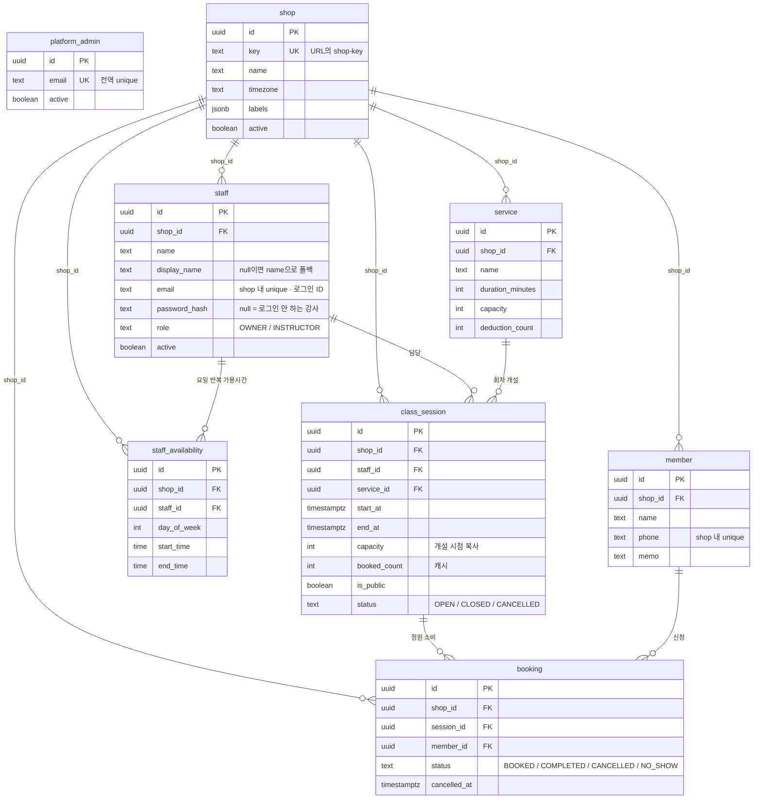
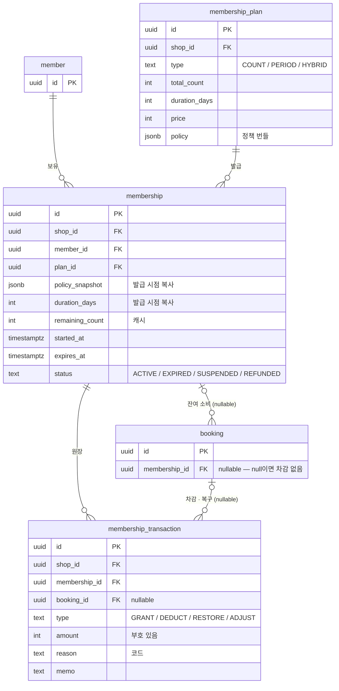

# 똑디 — 데이터 모델 설계 (첫 슬라이스)

> 2026-08-02 초안 · 2026-08-09 리뷰 반영 · 2026-08-16 갱신 (shop-key / 계정 / 공개 캘린더)
> **2026-08-16 갱신 2 — 회원권을 구현 슬라이스에서 분리** ([../decisions.md](../decisions.md))
> 범위: shop 생성 → 사업장 로그인 → 회원 등록 → 수업 개설 → 예약 → 공개 캘린더
> 병행 설계(구현 대기): 회원권 발급 → 자동 차감 → 잔여 확인
> 기획: [../README.md](../README.md) · 생애주기·시퀀스: [lifecycle.md](lifecycle.md) · 커스텀 스펙: [custom-spec.md](custom-spec.md) · 라우팅·계정: [tenancy.md](tenancy.md)

## 설계 원칙 4개

1. **도메인 중립** — staff / service / membership / booking. "선생님·수업"은 `shop.labels`로 화면에서만 치환. 마사지·에스테틱 확장의 기반.
2. **원장(ledger) 방식** — 잔여 횟수의 진실은 거래 이력(`membership_transaction`). `membership.remaining_count`는 캐시.
3. **정책은 값(JSONB)** — 기능 스위치가 아니라 회원권 상품에 묶인 정책 번들. 정책 추가할 때마다 마이그레이션 하지 않기 위함.
4. **shop_id는 전 테이블에, 예외 없이** — 나중에 멀티테넌시 붙이면 전 테이블을 손봐야 하고, LLM 조회 함수가 테넌트 필터를 join 없이 걸 수 있어야 남의 샵 데이터 유출을 막는 마지막 방어선이 된다.
   - 유일한 예외는 `platform_admin` — 테넌트 **위에** 있는 우리 계정이라 소속 shop이 없다. 예외가 하나뿐이어야 "shop_id 없는 테이블 = platform_admin" 이라는 검사가 성립한다.

---

## 구현 슬라이스 구분 (2026-08-16)

회원권은 **설계를 계속 구체화하면서 구현은 나중에** 붙인다. 예약 1건이 소비하는 자원 2개 중
자리(정원) 트랙만 먼저 만든다 — 근거: [../decisions.md](../decisions.md), 로직: [lifecycle.md](lifecycle.md)

| | 테이블 | 상태 |
|---|--------|------|
| 🟢 슬라이스 1 | `platform_admin` `shop` `staff` `member` `service` `staff_availability` `class_session` `booking` | 지금 구현 |
| 🟡 회원권 트랙 | `membership_plan` `membership` `membership_transaction` + `booking.membership_id` | 구체화 중 |

- 첫 마이그레이션에 🟡 테이블은 **넣지 않는다.** 아직 상태 전이가 안 닫혀 있고
  ([lifecycle.md](lifecycle.md) 6절), 확정 안 된 스키마를 깔면 곧 뒤집는 마이그레이션이 따라온다
- 나중에 붙이는 비용은 낮다. `booking.membership_id`가 처음부터 **nullable** 설계라
  `ALTER TABLE booking ADD COLUMN membership_id uuid NULL` 한 줄이면 되고, 기존 예약은
  자연스럽게 "회원권 없는 예약"으로 남는다
- 슬라이스 1에서는 모든 예약에 차감이 없다. **이건 파일럿 투입 가능한 제품이 아니다** —
  인터뷰 1의 핵심 페인(수기 차감)이 회원권 트랙에 있기 때문. 슬라이스 1은 기반 구축 단계로 본다

## ERD

### 🟢 슬라이스 1



`platform_admin`만 선이 없다 — 테넌트 **위에** 있어서 `shop_id`가 없는 유일한 테이블(원칙 4의 예외).
"shop_id 없는 테이블 = platform_admin"이 검사식으로 성립한다.

읽는 법 세 가지:

- **shop에서 나가는 6개 선이 원칙 4다.** 모든 조회의 첫 조건이 `shop_id = ?`
- **`booking`은 강사·서비스·시각을 갖지 않는다.** 전부 `class_session`이 갖고, 조회는 join.
  복사해두면 세션 시간이 바뀔 때 두 곳이 어긋난다 (2026-08-16 변경)
- **`staff_availability`는 예약과 직접 연결되지 않는다.** 세션을 만들 때 후보 시간을
  제안·검증하는 기준일 뿐, 예약 슬롯의 진실은 `class_session`

### 🟡 회원권 트랙이 붙었을 때



**nullable FK 2개가 이 그림의 핵심**이고, 표만 봐서는 안 보이는 부분이다.

- `booking.membership_id = null` → 회원권 없는 예약(체험 수업). 차감 없음.
  **슬라이스 1의 모든 예약이 이 상태다**
- `membership_transaction.booking_id = null` → 예약과 무관한 원장 줄(발급 `GRANT`,
  사장 수동 조정 `MANUAL_ADJUST`, 환불)
- `booking` 1건이 원장 **여러 줄**을 만든다 (차감 1 + 복구 1). 조회할 때 `SUM`을 쓰지
  마지막 줄만 보면 안 된다

---

## 테이블 (11개)

### platform_admin — 마스터 계정 (백오피스)

| 컬럼 | 타입 | 비고 |
|------|------|------|
| id | uuid PK | |
| email | text | **전역 unique** |
| password_hash | text | |
| name | text | |
| active | boolean | |
| created_at | timestamptz | |

원칙 4의 유일한 예외. shop을 생성하고 운영을 지원한다 — [tenancy.md](tenancy.md) 6절.

### shop — 테넌트

| 컬럼 | 타입 | 비고 |
|------|------|------|
| id | uuid PK | |
| key | text | **전역 unique** — URL의 `/{shop-key}`. 소문자 영숫자+하이픈 3~30자, 예약어 금지, 발급 후 변경 불가. 규칙: [tenancy.md](tenancy.md) 2절 |
| name | text | 로그인·공개 캘린더에 노출되는 샵 이름 |
| timezone | text | 기본 'Asia/Seoul' |
| labels | jsonb | `{"staff":"선생님","service":"수업","member":"회원"}` — 컬럼만 두고 설정 UI는 아직 안 엶 |
| active | boolean | false면 라우팅 차단 (미납·해지 샵) |
| created_at | timestamptz | |

### staff — 사업장 user (강사/관리사 + 로그인 계정)

| 컬럼 | 타입 | 비고 |
|------|------|------|
| id | uuid PK | |
| shop_id | uuid FK | |
| name | text | 실명. 관리자 화면에서만 씀 |
| display_name | text null | **공개 캘린더 표시명.** null이면 `name`으로 폴백 — 실명 공개를 꺼리는 강사만 채운다 |
| phone | text | |
| email | text null | `(shop_id, email)` unique. 로그인 ID |
| password_hash | text null | **null = 로그인 안 하는 강사** (이름만 등록된 사람) |
| must_change_password | boolean | true면 로그인 직후 비밀번호 변경 화면으로 강제 이동 |
| role | text | OWNER / INSTRUCTOR |
| active | boolean | 퇴사해도 과거 예약 이력은 남아야 하므로 삭제 대신 비활성 |

계정 테이블을 따로 두지 않고 여기에 합쳤다 (2026-08-16 결정). 1인샵은 사장 = 강사.
`role`은 컬럼만 두고 권한 분기는 강사 여러 명인 샵이 붙을 때 구현 — [tenancy.md](tenancy.md) 6절.

공개 캘린더로 나가는 건 `display_name ?: name` 하나뿐. `phone` / `email`은 공개 DTO에 절대 넣지 않는다.

### member — 회원

| 컬럼 | 타입 | 비고 |
|------|------|------|
| id | uuid PK | |
| shop_id | uuid FK | |
| name | text | |
| phone | text | `(shop_id, phone)` unique — 중복 등록 방지 |
| memo | text | 인터뷰 1의 페인 — 폰에서 바로 쓰는 자유 메모. 단일 필드(덮어쓰기)라 이력이 안 남음 — 시간순 기록은 `member_note`로 확장 (뺀 것 참고) |
| created_at | timestamptz | |

### service — 수업/시술 종류

| 컬럼 | 타입 | 비고 |
|------|------|------|
| id | uuid PK | |
| shop_id | uuid FK | |
| name | text | "1:1 개인레슨 50분" |
| duration_minutes | int | 뷰티 확장 시 시술별 소요시간이 여기로 |
| capacity | int | 1 = 1:1. 그룹은 2 이상 (첫 슬라이스는 1만 씀) |
| deduction_count | int | 기본 차감 횟수 (기본 1). 1:1=2차감 같은 가중치가 여기 |
| active | boolean | |

### staff_availability — 강사별 요일 반복 가용시간

| 컬럼 | 타입 | 비고 |
|------|------|------|
| id | uuid PK | |
| shop_id | uuid FK | 원칙 4 — 예외 없이 |
| staff_id | uuid FK | |
| day_of_week | int | 0~6 |
| start_time | time | shop.timezone 기준 |
| end_time | time | |

인터뷰 1: 선생님 5명 모두 가능 시간대가 다름 → 이 테이블이 **세션 개설 시 후보 시간 제안·검증**의
기준. (예약 슬롯의 진실은 `class_session`으로 옮겨갔다 — 아래 참고)
예외일(휴가·특근)은 다음 슬라이스에서 `staff_availability_exception`으로 추가.

### class_session — 개설된 수업 (공개 캘린더의 원천)

| 컬럼 | 타입 | 비고 |
|------|------|------|
| id | uuid PK | |
| shop_id | uuid FK | |
| staff_id | uuid FK | |
| service_id | uuid FK | |
| start_at | timestamptz | |
| end_at | timestamptz | 생성 시 `service.duration_minutes`로 채움 |
| capacity | int | 개설 시점의 `service.capacity` 복사 (그날만 정원을 줄이는 경우 대응) |
| booked_count | int | 캐시. 진실은 `booking` 카운트 — 원장 원칙과 같은 패턴 |
| is_public | boolean | **true여야 비로그인 캘린더에 노출** |
| status | text | OPEN / CLOSED / CANCELLED |
| created_at | timestamptz | |

"사장이 수업을 연다"는 행위를 담는 테이블. `staff_availability`(요일 반복 가용시간)에서 빈 슬롯을
계산하는 방식으로는 **특정 회차만 열기 / 임시 마감 / 정원 조정**이 표현되지 않는다.

- **1:1도 세션을 만든다.** 다만 사장이 매번 세션을 미리 만드는 건 부담이므로, 관리자가 예약을 잡을
  때 세션이 없으면 `is_public = false`로 즉석 생성한다 (ad-hoc). 공개 캘린더에 올릴 것만 명시적으로 오픈
- 강사 시간 겹침 방지는 **여기서** 체크한다 (예전엔 booking에 있던 책임). 구간 겹침은 유니크 제약으로
  못 막으므로 앱 레벨 체크가 유일한 방어 — 멀티 관리자 단계에서 Postgres EXCLUDE 제약 재검토
- 정원 초과 방지는 조건부 UPDATE: `SET booked_count = booked_count + 1 WHERE id = :id AND booked_count < capacity`
  (0행이면 실패 — 동시 예약 레이스 차단)
- `CANCELLED`(사장이 수업 취소)면 붙은 booking을 **전원 자동 취소 + 차감 무조건 복구**한다 —
  아래 "세션 취소" 참고

### membership_plan — 회원권 상품 (= 정책 번들)

| 컬럼 | 타입 | 비고 |
|------|------|------|
| id | uuid PK | |
| shop_id | uuid FK | |
| name | text | "10회권", "3개월 무제한" |
| type | text | COUNT / PERIOD / HYBRID |
| total_count | int null | 횟수제일 때 |
| duration_days | int null | 기간제일 때 |
| price | int | 원 단위 |
| policy | jsonb | 아래 참고 |
| active | boolean | |

```json
{
  "expiryStartsFrom": "PAYMENT",      // or FIRST_USE — 유효기간 기산점
  "holding": { "maxTimes": 2, "maxDays": 30 },
  "cancelDeadlineHours": 24,
  "lateCancelPenalty": "DEDUCT",       // NONE | DEDUCT
  "noShowPenalty": "DEDUCT",           // NONE | DEDUCT
  "deductionOverrides": { "<service_id>": 2 }
}
```

자주 필터링하는 값(type, total_count, price)만 컬럼으로 빼고 나머지는 JSONB.
Kotlin에서는 sealed class + data class로 파싱해서 타입 안전하게 다룸.

### membership — 발급된 회원권

| 컬럼 | 타입 | 비고 |
|------|------|------|
| id | uuid PK | |
| shop_id | uuid FK | |
| member_id | uuid FK | |
| plan_id | uuid FK | |
| policy_snapshot | jsonb | **발급 시점 정책 복사본** |
| status | text | ACTIVE / EXPIRED / SUSPENDED / REFUNDED |
| total_count | int null | |
| duration_days | int null | **발급 시점의 plan.duration_days 복사.** FIRST_USE는 만료일을 나중에 계산하므로, 그때 plan을 다시 읽으면 사장이 그사이 바꾼 기간이 소급 적용된다 |
| remaining_count | int null | 캐시 (진실은 transaction). PERIOD형은 null |
| started_at | timestamptz null | FIRST_USE면 **첫 예약의 세션 시작 시각**으로 채워짐 (2026-08-16 확정). 롤백 규칙은 아래 |
| expires_at | timestamptz null | |
| price_paid | int | 첫 슬라이스 한정 — 분할·추가 결제는 `payment` 테이블로 분리 예정 (뺀 것 참고) |
| paid_at | timestamptz | |

`policy_snapshot`이 중요: 사장이 나중에 상품 정책을 바꿔도 **이미 판 회원권의 조건은 그대로여야** 한다. 계약 조건이 소급되면 분쟁이 생김.

### booking — 예약

| 컬럼 | 타입 | 비고 |
|------|------|------|
| id | uuid PK | |
| shop_id | uuid FK | |
| session_id | uuid FK | **어느 세션에 붙은 예약인지.** 강사·서비스·시간은 세션이 갖는다 |
| member_id | uuid FK | |
| membership_id | uuid FK null | **어느 회원권으로 잡은 예약인지** — 차감 연결고리. null = 회원권 없는 예약(체험 수업 등), 차감 없음 |
| status | text | BOOKED / COMPLETED / CANCELLED / NO_SHOW |
| cancelled_at | timestamptz null | |
| created_at | timestamptz | |

- **staff_id / service_id / start_at / end_at을 여기서 뺐다** (2026-08-16). 세션에 있는 값을 복사해두면
  세션 시간이 바뀔 때 두 곳이 어긋난다. 세션은 삭제하지 않고 `CANCELLED`로 남기므로 이력도 안전.
  조회는 `booking JOIN class_session`.
- `(session_id, member_id)` unique — 같은 회원의 같은 세션 중복 예약 방지. 단, 취소 후 재예약을
  허용하려면 부분 인덱스(`WHERE status = 'BOOKED'`)로 걸어야 한다
- `status = NO_SHOW`가 곧 LLM 조회 "노쇼 횟수"의 원천.

### membership_transaction — 차감/복구 원장

| 컬럼 | 타입 | 비고 |
|------|------|------|
| id | uuid PK | |
| shop_id | uuid FK | 원칙 4 — LLM 조회가 가장 많이 때리는 테이블. 테넌트 필터를 join 없이 |
| membership_id | uuid FK | |
| booking_id | uuid FK null | |
| type | text | GRANT / DEDUCT / RESTORE / ADJUST |
| amount | int | +/- (GRANT +10, DEDUCT -1) |
| reason | text | 사유 코드 (아래) |
| memo | text null | 사장이 남기는 자유 사유 ("원장님 병가") |
| created_at | timestamptz | |

**이 테이블이 이 제품의 심장이다.** 인터뷰 1의 "차감을 수기로 한다"가 정확히 여기서 해결되고,
"박서현 회원 결제 금액·횟수 보여줘" 같은 LLM 조회도 전부 이 이력을 먹고 산다.
`remaining_count`가 틀어져도 `SUM(amount)`로 언제든 복구 가능.

`reason`은 자유 문자열이 아니라 **코드**로 둔다. 나중에 "샵 사유 휴강이 몇 번이었나" 같은 집계가
문자열 매칭 없이 된다.

| reason | type | 언제 |
|--------|------|------|
| `GRANT` | GRANT | 회원권 발급 |
| `BOOKING_DEDUCT` | DEDUCT | 예약 생성 |
| `CANCEL_RESTORE` | RESTORE | 마감선 전 취소 |
| `SESSION_CANCEL_RESTORE` | RESTORE | **샵 사유 수업 취소** — 마감선·패널티 정책 무관하게 항상 복구 |
| `NO_SHOW_RESTORE` | RESTORE | 노쇼인데 policy.noShowPenalty = NONE |
| `MANUAL_ADJUST` | ADJUST | 사장 수동 조정 (`memo` 필수) |

---

## 🟡 차감 로직 (2026-08-09 분기 보강 · 2026-08-16 확정 · **구현은 회원권 트랙**)

> 이 절 전체가 회원권 트랙이다. 슬라이스 1의 예약 생성은 아래에서 **세션 확인 단계까지만** 돈다
> (`membership` 이후 전부 생략). 시퀀스: [lifecycle.md](lifecycle.md) 4절

plan type에 따라 갈린다:

```
예약 생성
  → session 확인 (없으면 ad-hoc 생성: is_public = false)
      status = OPEN, 지난 시간 아님
      booked_count < capacity  ← 조건부 UPDATE로 증가 (0행이면 정원 마감 실패)
  → membership 유효성 확인
      공통:   status = ACTIVE, 만료 전(expires_at)
      COUNT:  잔여 ≥ deduction   ← "> 0" 아님. 2차감 수업을 잔여 1로 예약하면 음수가 됨
      PERIOD: 잔여 체크·차감 없음 (무제한, remaining_count = null)
      HYBRID: 만료 + 잔여 둘 다
  → deduction = service.deduction_count (policy.deductionOverrides 있으면 그 값)
  → COUNT/HYBRID만: transaction(DEDUCT, -deduction) 기록 + remaining_count 갱신
      ← 한 트랜잭션으로. 갱신은 조건부 UPDATE 패턴 권장:
        UPDATE membership SET remaining_count = remaining_count - :d
        WHERE id = :id AND remaining_count >= :d
        (0행이면 실패 처리 — 동시 예약 레이스에서도 음수 잔여 차단)
  → FIRST_USE 기산: started_at이 null이면
        started_at  = session.start_at      ← 예약을 잡은 시각이 아니라 수업 시각
        expires_at  = started_at + membership.duration_days   ← plan을 다시 읽지 않는다

예약 취소
  → 마감선(policy.cancelDeadlineHours, session.start_at 기준) 이전이면
        transaction(RESTORE, +deduction, CANCEL_RESTORE)
  → 이후면 policy.lateCancelPenalty에 따라: DEDUCT = 미복구 / NONE = 복구
  → 어느 쪽이든 session.booked_count 감소 (자리는 돌려준다 — 차감 복구와 별개)
  → FIRST_USE 롤백: 위에서 RESTORE가 발생했고 이 예약이 기산점이었다면
        남은 BOOKED 예약 중 가장 이른 session.start_at으로 재계산
        없으면 started_at = expires_at = null   ← 다음 예약 때 다시 기산

노쇼 처리
  → status = NO_SHOW
  → policy.noShowPenalty에 따라: DEDUCT = 복구 안 함 / NONE = transaction(RESTORE, +deduction)
     (정책은 값 — 원칙 3. 하드코딩하지 않는다)
  → RESTORE가 발생했으면 위와 같은 FIRST_USE 롤백 규칙 적용

세션 취소 (사장이 수업을 닫음 — 샵 사유)
  → session.status = CANCELLED
  → 붙은 booking 전부 CANCELLED
  → 전원 transaction(RESTORE, +deduction, SESSION_CANCEL_RESTORE)
        ← 마감선·lateCancelPenalty와 무관하게 무조건 복구. 샵 사유니까
  → booked_count = 0
  → RESTORE이므로 FIRST_USE 롤백 규칙이 그대로 적용됨
```

차감 시점을 "예약 시"로 잡음. 샵에 따라 "수업 완료 시" 차감을 원할 수 있으나 정책 값으로 나중에 추가.

### FIRST_USE 규칙 한 줄 요약 (2026-08-16 확정)

> **기산은 첫 예약의 수업 시각으로. 횟수를 돌려받으면 기간도 돌아간다.**

- 기산에 "수업 완료 처리"를 걸지 않았다. 우리 모델은 예약 시점 차감이라 `COMPLETED` 전이가 없어도
  장부가 돌아가고, 수기 차감하던 사장이 완료 버튼을 매번 누를 거라 기대하기 어렵다.
  완료를 기준으로 삼으면 아무도 안 눌러서 유효기간이 영원히 시작 안 되는 회원권이 생긴다
- 노쇼는 차감이 유지되므로(패널티 DEDUCT) 기산도 유지된다 — "소비된 예약"이라는 해석이 일관됨
- 별도 배치·스케줄러가 필요 없다. 예약 생성 시점에 미래 시각을 확정해 넣을 뿐

## 결정 필요

2026-08-16 오전에 5건을 닫았는데, 그날 **상태 전이도를 그리면서 6건이 새로 나왔다.**
표(컬럼·값 목록)로는 안 보이고 전이도로 그려야 드러나는 것들이라, 상세와 선택지는
[lifecycle.md](lifecycle.md)에 있다.

| # | 쟁점 | 트랙 | 상세 |
|---|------|------|------|
| 1 | `booking.COMPLETED` 전이 주체 — 아무도 안 누르면 지난 예약이 영원히 `BOOKED` | 🟢 슬라이스 1 | [lifecycle.md](lifecycle.md) 3절 |
| 2 | `membership.EXPIRED` 전이 주체 — 배치인가 조회 시 lazy 판정인가 | 🟡 | 6-1 |
| 3 | 기간은 남고 횟수만 소진된 상태 — `EXHAUSTED`를 추가할 것인가 | 🟡 | 6-2 |
| 4 | 환불 시 원장 처리 — `reason` 코드에 환불이 없다. 부분 환불은 `payment` 분리와 묶임 | 🟡 | 6-3 |
| 5 | `SUSPENDED`(홀딩) 진입 경로가 없다 — 만료일 연장·예약 차단·횟수 카운터 위치 | 🟡 | 6-4 |
| 6 | FIRST_USE 롤백이 **만료를 앞당길 수 있다** — 회원에게 불리한 방향 | 🟡 | 7절 |

**1번만 슬라이스 1을 막는다.** 나머지 5건은 회원권 트랙에서 구현 착수 전까지 닫으면 된다.

---

## 첫 슬라이스에서 뺀 것

| 항목 | 이유 |
|------|------|
| **회원(member) 로그인·셀프 예약** | 이번 범위는 사업장 user만. 회원은 관리자가 대신 등록하고, 회원 쪽에 열리는 건 **비로그인 공개 캘린더 조회**뿐 ([tenancy.md](tenancy.md) 7절) |
| 대기자 | 정원은 `class_session.capacity`로 돌아가지만 마감 시 대기 큐는 안 만듦 |
| 정기 예약 (매주 화 10시 고정) | 세션 반복 생성 UI 포함. `class_session`을 매번 만드는 부담이 실제로 나오면 그때 |
| 그룹 수업 운영 화면 | 스키마(capacity, booked_count)는 그룹을 담지만 인터뷰 1이 1:1이라 화면은 1:1 기준으로 먼저 |
| **payment 테이블 (결제 분리)** | 첫 슬라이스는 회원권 1건 = 결제 1건(price_paid/paid_at)으로 고정. 분할 결제·연장 추가 결제·부분 환불이 생기는 순간, 그리고 "이번 달 결제 총액" LLM 조회를 정확히 하려면 분리 필요 |
| **member_note (시간순 메모 + 사진)** | 인터뷰 1의 실제 니즈는 "수업 끝나고 폰으로 메모+사진" = 쌓이는 기록. member.memo(단일 text)는 임시 — MVP+1 사진 업로드 붙일 때 member_note(member_id, body, photo_url, created_at)로 |
| 자원(베드/룸) | 뷰티 버티컬용. Resource 테이블은 확장 시 추가 |
| 강사 예외 스케줄(휴가) | 반복 스케줄 먼저 |
| 홀딩 실행, 환불 계산 | 정책 필드만 두고 로직은 나중 |
| 선불충전권(금액 차감형) | [custom-spec.md](custom-spec.md) 유형 예시에 있으나 COUNT/PERIOD/HYBRID로 못 담음(횟수가 아니라 금액 잔액). 뷰티 확장 시 type 추가 |
| 회원 커스텀 필드 (부상 이력·피부 타입·태그 등) | [custom-spec.md](custom-spec.md) 영역 5. 첫 슬라이스는 memo만 — 확장 시 member에 custom_fields JSONB + shop별 필드 정의 |
| 사진·계약서 업로드, 설문, 알림톡 | MVP+1 이후 ([../mvp.md](../mvp.md) 백로그) |
| LLM 조회 | 데이터 쌓인 뒤. 조회 함수는 이 모델 확정 후 작성 |

## 다음 단계

**서현 (백엔드)**

구현(🟢)과 설계(🟡)를 **병행**한다.

1. ~~이 모델 리뷰 → 확정~~ → 2026-08-16 확정 완료
2. 🟢 Kotlin + Spring Boot 프로젝트 생성 (Gradle, Postgres, Flyway) + 엔티티/도메인 클래스
   — 마이그레이션은 슬라이스 1의 8개 테이블만
3. 🟢 TenantResolver + 인증 (platform_admin / staff) — [tenancy.md](tenancy.md) 4·5절
4. 🟢 API:
   - 백오피스: shop 생성(+최초 OWNER), shop 목록
   - 사업장: 로그인 / 회원 등록 / 세션 개설·공개 / 예약 생성 / 예약 취소·노쇼
   - 공개: `GET /{shop-key}/schedule` (인증 없음, 전용 DTO)
   - 착수 전 `COMPLETED` 처리 결정 필요 ([lifecycle.md](lifecycle.md) 3절)
5. 🟡 회원권 트랙 — 위와 **동시에** 진행. 결정 필요 5건을 닫는 게 먼저이고,
   구현은 슬라이스 1이 돌아간 뒤 스키마 추가로 붙인다

**민수 (프론트)**

1. RN(Expo) 웹 타깃 실현 가능성 검증 — 라우팅(`/{shop-key}/...` 딥링크), 반응형, 빌드·배포
2. 백오피스 화면 (shop 생성·목록)
3. 사업장 user 화면 (로그인 → 회원 목록·상세 → 세션 개설 → 예약 잡기, 폰 기준)
4. 공개 캘린더 화면 (비로그인)
