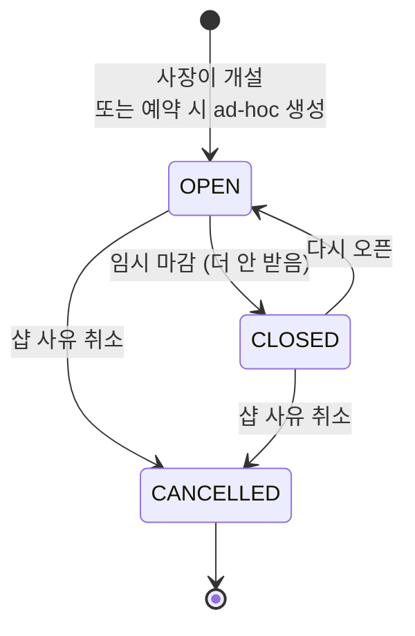
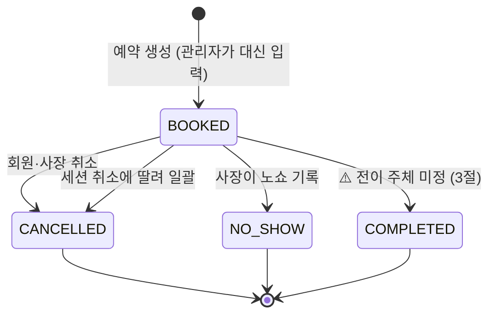
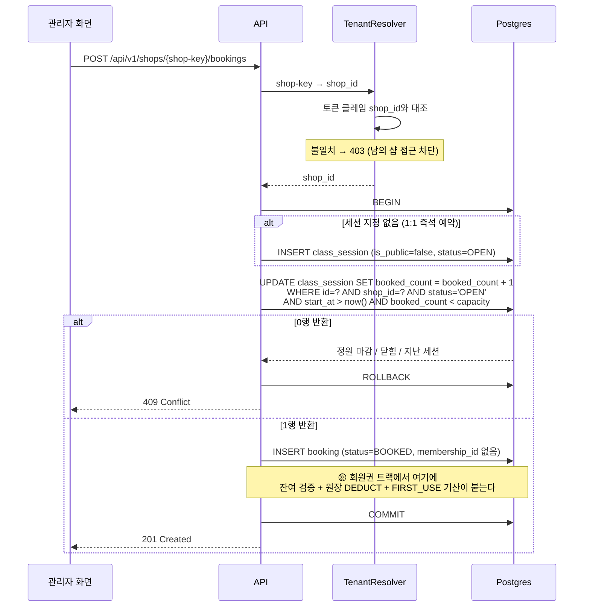
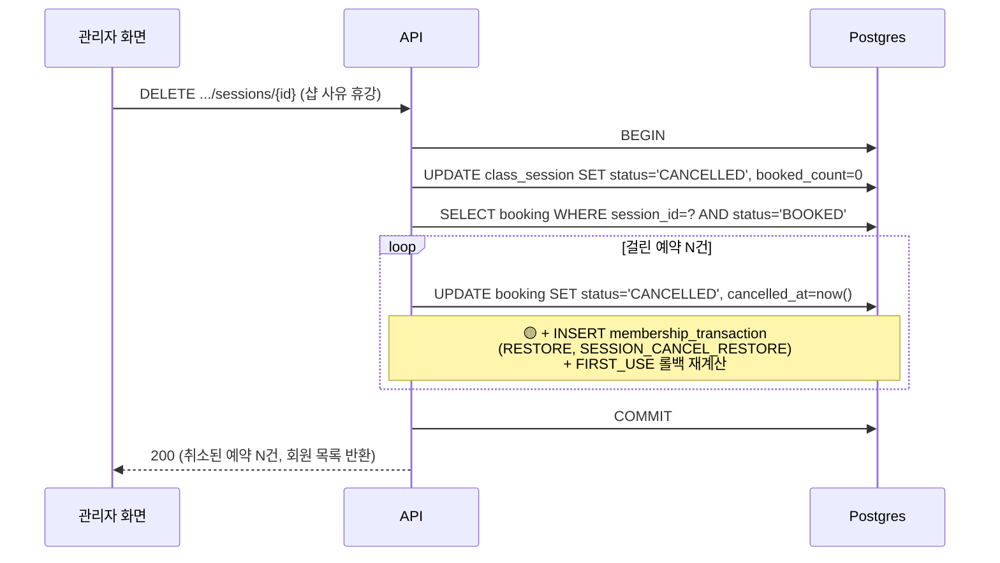
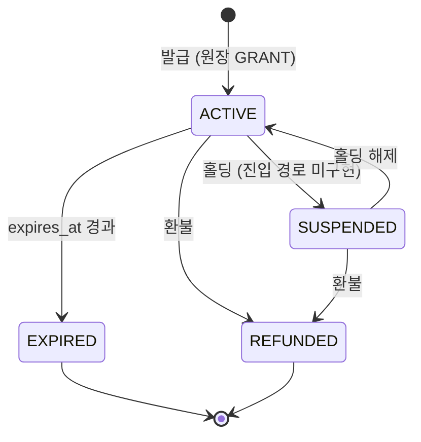
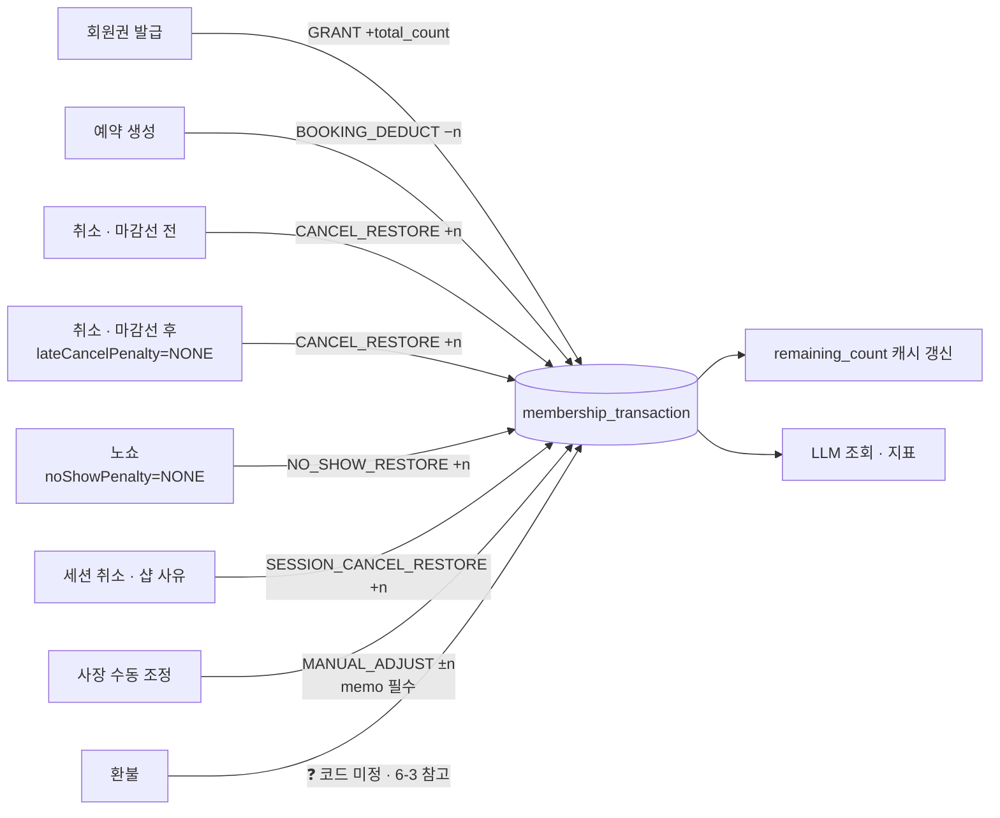

# 생애주기 · 흐름 도식

> 2026-08-16 작성 · 데이터 모델: [data-model.md](data-model.md) · 라우팅: [tenancy.md](tenancy.md)
> 표로는 안 보이는 것 — **상태 전이 조건**, **트랜잭션 경계**, **시간 축** — 만 여기 모은다.

## 0. 이 제품 로직의 한 줄

> **예약 1건은 서로 다른 자원 2개를 동시에 소비한다. 취소할 때 둘은 다른 규칙으로 돌아온다.**

```
booking 1건
  ├─ class_session.booked_count   ← 자리(정원).  항상 돌려준다
  └─ membership 잔여 횟수          ← 원장.       정책에 따라 조건부로 돌려준다
```

이 비대칭이 이 제품의 난이도 전부다. 그리고 **슬라이스 1은 위쪽 트랙만 만든다**
(회원권 분리 — [../decisions.md](../decisions.md) 2026-08-16). 아래 도식들은 트랙별로 표시했다.

| 표기 | 뜻 |
|------|-----|
| 🟢 | 슬라이스 1 — 지금 구현 |
| 🟡 | 회원권 트랙 — 구체화 진행 중, 구현은 나중 |

---

## 1. 🟢 세션 생애주기 (`class_session.status`)



- `is_public`은 **status와 직교한 축**이다. `OPEN`이어도 `is_public = false`면 공개 캘린더에 안
  나온다. ad-hoc 생성(예약 잡을 때 세션이 없어서 즉석으로 만드는 경우)이 항상 이 조합이다
- **정원이 찬 것은 상태가 아니다.** `booked_count == capacity`여도 `status`는 `OPEN`으로 둔다.
  예약 차단은 조건부 UPDATE가 0행을 반환하는 것으로 처리 — 자동 `CLOSED` 전이를 넣으면 취소가
  발생할 때마다 되돌리는 로직이 따라붙는다. `CLOSED`는 사장의 명시적 행위로만
- `CANCELLED`는 종착이다. 되살리지 않는다 — 붙어 있던 booking을 전부 되살릴 방법이 없다.
  잘못 취소했으면 새 세션을 만든다
- 세션은 **삭제하지 않는다**. 지난 예약 이력이 세션을 join해서 시각·강사를 읽기 때문

## 2. 🟢 예약 생애주기 (`booking.status`)



### 전이별 자원 반환표 — 이 표가 3절·4절의 실행 사양이다

| 전이 | 자리 (`booked_count`) | 🟡 횟수 (원장) | 🟡 FIRST_USE 기산 |
|------|----------------------|----------------|-------------------|
| 취소 · 마감선 **전** | 반환 (−1) | 복구 `CANCEL_RESTORE` | 롤백 |
| 취소 · 마감선 **후** · `lateCancelPenalty = DEDUCT` | 반환 (−1) | **유지** | 유지 |
| 취소 · 마감선 **후** · `lateCancelPenalty = NONE` | 반환 (−1) | 복구 `CANCEL_RESTORE` | 롤백 |
| 노쇼 · `noShowPenalty = DEDUCT` | 유지 | **유지** | 유지 |
| 노쇼 · `noShowPenalty = NONE` | 유지 | 복구 `NO_SHOW_RESTORE` | 롤백 |
| 세션 취소 (샵 사유) | `booked_count = 0` | **무조건** 복구 `SESSION_CANCEL_RESTORE` | 롤백 |

- **자리는 취소면 무조건 돌려준다.** 마감선·패널티는 회원권 쪽 규칙이지 정원 쪽 규칙이 아니다.
  늦게 취소해서 횟수를 잃더라도 그 자리는 다른 회원이 쓸 수 있어야 한다
- **노쇼는 자리를 안 돌려준다.** 이미 지난 수업이라 돌려줄 대상이 없다. `booked_count`를 줄이면
  "그날 몇 명 왔나"가 사후에 틀어진다
- 마감선은 `policy.cancelDeadlineHours`를 **`session.start_at` 기준**으로 잰다 (예약 생성 시각 아님)
- 🟡 열이 곧 회원권 트랙의 구현 범위다. 슬라이스 1에서는 `booking.membership_id`가 없으므로
  모든 예약이 "회원권 없는 예약"이고 원장이 아예 안 움직인다

## 3. ⚠️ 결정 필요 — `COMPLETED`는 누가 만드나 (🟢 슬라이스 1 안건)

지금 문서가 서로 엇갈린다.

- `booking.status`에 `COMPLETED`가 있다
- 그런데 [../decisions.md](../decisions.md)는 "우리 모델은 예약 시점 차감이라 `COMPLETED` 전이가
  없어도 장부가 돌아간다 / 사장이 완료 버튼을 매번 누를 거라 기대할 수 없다"고 확정했다

아무도 안 누르면 **지난 수업이 영원히 `BOOKED`로 남는다.** 노쇼도 아니고 완료도 아닌 예약이 쌓이면
나중에 출석률·소진율 같은 지표가 안 나오고, 화면에서도 "오늘 할 일"과 "끝난 일"이 안 갈린다.

선택지:

| 안 | 방식 | 대가 |
|----|------|------|
| A | `COMPLETED`를 **없앤다**. `BOOKED` + `end_at < now()` = 완료로 간주 | 상태 값 하나 삭제. 조회에 시각 조건이 붙음. 가장 단순 |
| B | 시간 경과 시 **자동 전이** (배치 또는 조회 시 lazy) | 배치 인프라. "노쇼 기록"이 자동 전이보다 늦으면 뒤집어야 함 |
| C | 지금대로 두고 **사장이 누른다** | 안 누른다는 걸 이미 결정문에 적어놨다. 사실상 A가 되는데 상태 값만 남음 |

권장은 **A**. 노쇼는 사장이 명시적으로 기록하는 예외 표시고, 나머지는 시간이 지나면 완료라는 게
1인샵 운영에 맞는다. B의 자동 전이는 회원 셀프 예약이 열려서 "완료 후 후기" 같은 게 붙을 때 하면 된다.

## 4. 🟢 시퀀스 — 예약 생성 (슬라이스 1)

동시성과 트랜잭션 경계는 표로 표현이 안 된다.



- 조건부 UPDATE 하나로 **정원 초과·마감 세션·지난 세션**을 동시에 막는다. `SELECT` 후 `INSERT`는
  두 관리자가 동시에 누르면 정원을 넘긴다
- ad-hoc 세션 생성과 booking INSERT가 **같은 트랜잭션**이어야 한다. 안 그러면 예약이 실패했을 때
  주인 없는 빈 세션이 남는다
- 강사 시간 겹침 체크는 세션 생성 경로에만 있다 (booking에는 없음). 앱 레벨 체크가 유일한 방어선

## 5. 🟢 시퀀스 — 세션 취소 (팬아웃)



- 1건의 행위가 N건으로 퍼진다. **전부 한 트랜잭션.** 중간에 깨지면 "세션은 취소됐는데 예약은
  살아있는" 상태가 되고, 회원은 취소된 수업에 나온다
- 응답에 **영향받은 회원 목록**을 돌려줘야 한다. 사장이 그 길로 카톡을 보내야 하므로.
  알림톡 자동 발송은 V1이지만 명단은 지금부터 필요
- 🟡가 붙는 순간 이 루프가 원장 N건까지 쓰게 된다. 슬라이스 1에서 루프 구조를 잡아두면
  회원권 트랙에서 INSERT 한 줄만 추가된다

---

# 회원권 트랙 (🟡 구체화 중)

여기부터는 **구현 대기, 설계 진행** 구역이다. 슬라이스 1을 만드는 동안 이 절을 채운다.

## 6. 🟡 회원권 생애주기 (`membership.status`)



그려보니 **미정이 4개** 나온다. 데이터 모델의 "결정 필요"는 비어 있었지만 상태 전이는 아직 안 닫혔다.

### 6-1. `EXPIRED` 전이는 누가 일으키나

`expires_at`은 미래 시각으로 박혀 있고, 그 시각이 지나도 아무도 `status`를 안 바꾼다.

- **lazy 판정** — DB에는 `ACTIVE`로 두고 읽을 때마다 `expires_at < now()`로 판단. 배치 불필요.
  대신 모든 조회에 조건이 붙고, "만료 회원권 몇 건" 같은 집계가 status 하나로 안 된다
- **배치** — 매일 새벽 일괄 전이. 상태가 곧 진실이라 조회가 단순. 배치 인프라가 생긴다

FIRST_USE를 "배치 불필요"로 설계한 것과 결이 맞으려면 lazy가 일관되지만, 만료 임박 알림(V1)이
붙는 순간 어차피 스케줄러가 필요해진다. **알림 기능 시점에 배치로 통합**하는 쪽을 권장.

### 6-2. 잔여 0은 `EXPIRED`인가 — `EXHAUSTED`가 필요한가

COUNT형에서 **기간은 남았는데 횟수만 소진**된 상태가 지금 표현이 안 된다.

```
10회권, 3개월 유효 · 2개월차에 10회 다 씀
  → status = ACTIVE  (기간 안 지났으니)
  → 그런데 예약은 안 됨 (잔여 0)
```

이건 **재구매 전환 지점**이라 상태로 구분할 가치가 크다. 사장 화면에서 "곧 끝나는 회원"과
"이미 다 쓴 회원"은 다른 액션이고, LLM 조회("재등록 필요한 회원 알려줘")도 이걸 먹는다.

- 안 A: `EXHAUSTED` 상태 추가 (기간 만료와 소진을 구분)
- 안 B: 상태는 `ACTIVE`로 두고 화면·조회에서 `remaining_count = 0`으로 판단

권장 **B + 파생 개념**. 상태를 늘리면 전이 경우의 수가 곱해진다 (소진 후 기간도 만료되면? 홀딩 중
소진이면?). `remaining_count = 0 AND expires_at > now()` 이라는 **조회 조건**으로 충분하고,
잔여의 진실은 어차피 원장이다.

### 6-3. `REFUNDED`는 원장에 뭘 남기나

`reason` 코드 6개에 환불이 없다. 환불하면 남은 횟수는 어떻게 되나:

- 잔여를 0으로 만드는 `ADJUST`를 넣나 → 그럼 `MANUAL_ADJUST`와 구분이 안 됨
- `REFUND_VOID` 같은 코드를 추가하는 게 맞아 보인다. "환불로 소멸시킨 횟수"가 집계돼야
  "환불률·환불 금액" 지표가 나온다
- 그리고 **부분 환불**(5회 남은 10회권을 반만 돌려줌)은 `price_paid` 단일 컬럼으로 표현이 안 된다.
  이건 `payment` 테이블 분리와 묶인 문제 — [data-model.md](data-model.md) "뺀 것" 참고

### 6-4. `SUSPENDED` 진입 경로가 없다

홀딩은 "정책 필드(`policy.holding`)만 두고 로직은 나중"이라 상태로 들어갈 방법이 지금 없다.
홀딩을 구현할 때 같이 정해야 하는 것: 홀딩 기간만큼 `expires_at`을 **미루는가**(보통 그렇다),
홀딩 중 예약은 막는가, 홀딩 횟수 카운터는 어디에 두는가(`membership`에 컬럼 or 원장 이벤트).

## 7. 🟡 회원권 시간 축 — `expiryStartsFrom`

말로 설명하기 제일 어려운 부분. 파일럿 사장님께 설명할 때도 이 그림을 쓴다.

### PAYMENT 기산

```
  결제              ─────────────── duration_days ───────────────▶  만료
   │                                                                 │
paid_at                                                         expires_at
started_at = paid_at

  예약을 한 번도 안 잡아도 기간은 흐른다.
```

### FIRST_USE 기산 (2026-08-16 확정)

```
  결제    ····· 잠자는 구간 (기간 안 흐름) ·····   첫 수업   ─── duration_days ───▶  만료
   │                                                 │                              │
paid_at                                     session.start_at                   expires_at
                                    started_at = 그 세션의 "수업 시각"
                                    ← 예약을 잡은 시각이 아니다
```

- 기산 시점에 **미래 시각을 확정해서 넣는다.** 그래서 배치가 필요 없다
- `expires_at` 계산에 `plan.duration_days`가 아니라 **`membership.duration_days`(발급 시점 복사본)**
  를 쓴다. 사장이 그사이 상품을 바꿔도 판 회원권 조건은 안 바뀌어야 하므로

### ⚠️ 발견한 함정 — 롤백이 만료를 **앞당길** 수 있다

확정된 규칙("RESTORE가 발생했고 그 예약이 기산점이었다면, 남은 예약 중 가장 이른 수업 시각으로
재계산")을 그대로 따르면 이렇게 된다.

```
90일 회원권, FIRST_USE 기산

t0  예약A 생성 (수업일 3/10)
      → started_at = 3/10,  expires_at = 6/08

t1  예약B 생성 (수업일 3/05)      ← A보다 이른 수업을 나중에 예약
      → started_at 이미 non-null → 변화 없음 (6/08 유지)

t2  예약A 취소 (마감선 전 → RESTORE 발생, A가 기산점이었음)
      → 남은 BOOKED 중 가장 이른 = 예약B (3/05)
      → started_at = 3/05,  expires_at = 6/03      ← 만료가 5일 당겨진다
```

회원 입장에선 "취소했더니 유효기간이 줄었다"로 보인다. 규칙 자체는 일관되지만
(*첫 사용 = 가장 이른 수업*), 분쟁 소지가 있는 방향이다. 선택지:

| 안 | 규칙 | 결과 |
|----|------|------|
| A | 지금대로 (가장 이른 수업으로 재계산) | 정의는 일관. 만료가 당겨질 수 있음 |
| B | 롤백 시 재계산하되 **기존 `expires_at`보다 당기지 않는다** (max 적용) | 회원에게 유리. 규칙에 예외 한 줄 |
| C | 예약 생성 시에도 더 이른 수업이면 **앞당긴다** (양방향 일관) | 정의는 가장 깔끔. 그런데 예약할 때마다 만료가 당겨지는 건 더 이상함 |

권장 **B**. "돌려받는 건 돌려주되, 이미 알려준 만료일보다 불리하게는 안 간다"가 설명 한 줄로 되고,
사장이 회원에게 답할 말이 생긴다. 원장 원칙과도 충돌하지 않는다 (횟수는 그대로 복구).

## 8. 🟡 원장 이벤트 지도

어떤 행위가 어떤 원장 줄을 만드는지 한 장.



- 원장에 줄이 **안 생기는** 행위도 명시해둘 가치가 있다: 취소 · 마감선 후 · `DEDUCT`(횟수 유지),
  노쇼 · `DEDUCT`(유지), 회원권 없는 예약(체험). 이 셋은 자리만 움직이고 장부는 안 움직인다
- `remaining_count`는 캐시다. 틀어져도 `SUM(amount)`로 언제든 복구되므로, 의심스러우면
  재계산하는 관리 스크립트를 초기에 하나 만들어두면 좋다

---

## 아직 안 그린 것

| 도식 | 언제 |
|------|------|
| 사업장 user 화면 흐름도 (폰 기준) | 민수 Figma 착수 시. 3절 결론(`COMPLETED` 처리)이 "오늘 화면" 설계를 바꾼다 |
| 회원권 구매·연장·환불 시퀀스 | `payment` 테이블 분리 결정 후 |
| LLM 조회 함수 호출 흐름 | 데이터 쌓인 뒤 |
| 홀딩 시퀀스 | 6-4 결정 후 |
