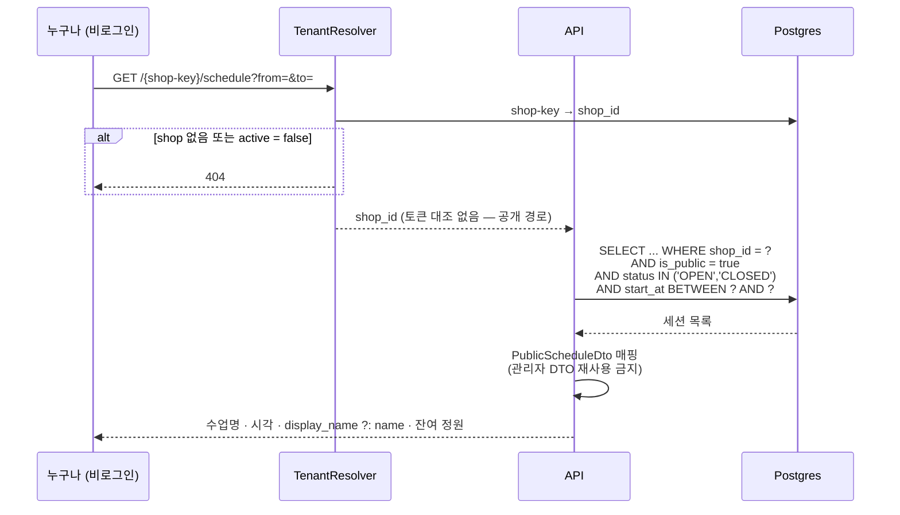

# 테넌트 라우팅 · 계정 구조

> 2026-08-16 · 결정 근거: [../decisions.md](../decisions.md) (2026-08-16 항목 4개)
> 데이터 모델: [data-model.md](data-model.md)

단일 멀티테넌트(서버 하나, shop_id로 분리) 전제 위에서 **shop을 어떻게 식별하고 누가 어디로
로그인하는가**를 정한다.

## 1. shop 생성

셀프 가입 없음. 마스터(`platform_admin`)가 백오피스에서 만든다.

```
백오피스 → shop 생성
  입력: 샵 이름, shop-key, 타임존(기본 Asia/Seoul)
      + 최초 OWNER staff 1명 (이름, email)
  처리: 임시 비밀번호 랜덤 생성, must_change_password = true
  결과: 완료 화면에 URL·ID·임시 비밀번호를 1회 표시 → 우리가 카톡으로 전달
        <도메인>/{shop-key} 로 즉시 접속 가능
```

- 최초 OWNER를 같이 만들어야 한다. 안 그러면 shop만 있고 아무도 못 들어가는 상태가 된다
- 임시 비밀번호는 **다시 볼 수 없다**(해시만 저장). 놓치면 재발급 — 백오피스에 재발급 버튼 필요
- 초대 링크(만료 토큰) 방식은 셀프 온보딩을 열 때 교체 (2026-08-16 결정)

## 2. shop-key 규칙

| 항목 | 규칙 |
|------|------|
| 문자 | 소문자 영숫자 + 하이픈 `[a-z0-9-]` |
| 길이 | 3~30자 |
| 제약 | 하이픈으로 시작·종료 불가, 연속 하이픈 불가, 숫자로만 구성 불가 |
| 유일성 | **전역 unique** (shop_id 범위 아님 — URL 최상위에 오므로) |
| 변경 | 발급 후 변경 불가를 기본으로. 바꾸려면 구 key → 신 key 리다이렉트 테이블이 따로 필요 |

**예약어 금지 목록** — 나중에 서브도메인·시스템 경로와 충돌하지 않게 지금부터 막아둔다:

```
admin, api, app, www, static, assets, cdn, health, status,
login, logout, signup, backoffice, docs, help, support, blog,
mail, ns, dev, stage, test, ddoukd, ddokd, ddocd
```

## 3. URL 구조

| 대상 | 경로 | 인증 |
|------|------|------|
| 백오피스 (마스터) | `/backoffice/...` | platform_admin |
| 사업장 로그인 | `/{shop-key}/login` | 없음 |
| 사업장 관리 화면 | `/{shop-key}/...` | staff |
| 공개 수업 캘린더 | `/{shop-key}/schedule` | **없음 (비로그인)** |
| API | `/api/v1/shops/{shop-key}/...` | staff 토큰 |
| 백오피스 API | `/api/v1/backoffice/...` | platform_admin 토큰 |

백오피스는 테넌트 밖이라 `/{shop-key}` 아래에 두지 않는다. 예약어 목록에 `backoffice`, `api`가
들어간 이유.

## 4. 서브도메인 전환 대비

지금 경로 방식으로 가되, 전환 지점을 코드 한 곳으로 좁혀둔다.

```
요청 → TenantResolver (여기 하나만 shop-key를 안다)
         경로에서 추출  ← 지금
         호스트에서 추출 ← 전환 후
       → shop_id 해석 + 존재/활성 확인
       → 요청 컨텍스트에 shop_id 저장
서비스·리포지토리 계층 → shop_id만 본다 (shop-key를 모름)
```

전환할 때 붙는 인프라 작업(민수): 와일드카드 DNS `*.<도메인>`, 와일드카드 인증서
(Let's Encrypt는 DNS-01 챌린지 필요), 리버스 프록시 호스트 라우팅, 기존 경로 URL의 301 리다이렉트.

## 5. 세션·토큰 (경로 방식의 함정)

경로 방식은 모든 샵이 **같은 오리진**을 쓴다. 쿠키·localStorage가 샵 사이에 공유된다는 뜻이다.

- 토큰에 `shop_id`를 클레임으로 넣고, 서버가 **URL의 shop-key와 토큰의 shop_id가 일치하는지
  매 요청 대조**한다. 불일치면 403. 이게 없으면 A샵 사장이 로그인한 채 `/{b-shop}/members`를
  치는 것만으로 남의 데이터가 열린다
- 프론트에서 토큰을 저장할 때 키에 shop-key를 포함시켜 샵 전환 시 섞이지 않게 한다
- 서브도메인으로 가면 오리진이 분리되어 이 문제가 자연히 사라진다 — 전환의 부수 이득

## 6. 계정 3종

| | platform_admin | staff | member |
|---|---|---|---|
| 누구 | 우리(단디) | 사업장 사장·강사 | 회원 |
| shop_id | 없음 (테넌트 위) | 있음 | 있음 |
| 로그인 | O | O (`password_hash` null이면 불가) | **X — 이번 범위 밖** |
| email unique | 전역 | `(shop_id, email)` | — |
| 역할 | shop 생성·조회, 운영 지원 | OWNER: 전체 / INSTRUCTOR: 본인 스케줄·예약 | — |

- 같은 사람이 여러 샵의 staff면 shop마다 별도 행 + 별도 로그인. 한 계정으로 샵 전환하는 구조는
  안 만든다 (프랜차이즈·멀티지점 나올 때 재검토)
- INSTRUCTOR가 실제로 뭘 못 보게 할지는 파일럿(1인샵)에선 의미가 없다. 컬럼만 두고 권한 분기는
  강사 여러 명인 샵이 붙을 때 구현
- 마스터의 샵 데이터 열람은 지원 목적으로 필요해지지만, 남의 장부를 보는 행위다 —
  접근 로그를 남기는 걸 전제로 나중에 설계

## 7. 공개 캘린더 노출 범위

`/{shop-key}/schedule` 은 비로그인 공개다. **나가는 것과 안 나가는 것을 명시적으로 고정한다.**

| 나감 | 안 나감 |
|------|---------|
| 샵 이름, 영업 정보 | 회원 이름·연락처·예약 여부 (**어떤 형태로도**) |
| 수업명, 시작·종료 시각 | 회원권·결제·노쇼 정보 |
| 강사 표시명 (`display_name ?: name`) | 강사 실명(표시명이 있으면), 연락처, 비공개 세션(`is_public = false`) |
| 잔여 정원 / 마감 여부 | 취소된 세션의 상세 |

- 응답 DTO를 관리자용과 **분리**한다. 관리자용 DTO를 재사용하면 필드 하나 추가할 때마다
  공개 API로 새어나간다
- 강사 실명 노출은 당사자 동의 사항이라 `staff.display_name`을 따로 뒀다 (2026-08-16 확정).
  null이면 `name`으로 폴백하므로 사장 입력 부담은 0, 꺼리는 강사만 닉네임을 채운다
- 조회 API는 인증이 없으므로 IP 기준 rate limit이 필요해진다 (파일럿 규모에선 후순위, 잊지 말 것)

### 공개 캘린더 요청 흐름

인증이 없는 유일한 경로다. 필터 3개가 전부 서버에 있어야 한다.



- 필터 3개(`is_public` / `status` / `shop_id`) 중 **하나라도 빠지면 사고**다. 각각
  비공개 ad-hoc 세션 노출 / 취소된 수업 노출 / 남의 샵 노출로 이어진다
- `shop.active = false`면 404. 미납·해지 샵의 캘린더가 계속 살아있으면 안 된다
- `PublicScheduleDto`를 **별도 클래스**로 둔다. 관리자 DTO에 필드를 추가하는 순간
  공개 API로 새어나가는 구조를 애초에 만들지 않는다

## 8. 권한 매트릭스

C=생성 R=조회 U=수정 D=삭제(비활성) — 리소스별로 한 장에 고정한다.

| 리소스 | platform_admin | staff · OWNER | staff · INSTRUCTOR | 비로그인 |
|--------|:--------------:|:-------------:|:------------------:|:--------:|
| shop (생성·목록) | C R U | — | — | — |
| staff | C (최초 OWNER) | C R U D | R (본인) | — |
| member | R ※ | C R U D | R | — |
| service | — | C R U D | R | — |
| staff_availability | — | C R U D | C R U D (본인) | — |
| class_session | — | C R U D | C R U D (본인 담당) | **R (공개분만)** |
| booking | — | C R U D | C R U D (본인 세션) | — |
| 🟡 membership_plan | — | C R U D | R | — |
| 🟡 membership | — | C R U D | R | — |
| 🟡 membership_transaction | — | C R (수동 조정) | R | — |

- ※ 마스터의 샵 데이터 열람은 **운영 지원 목적으로만**. 남의 장부를 보는 행위라 접근 로그를
  남기는 걸 전제로 나중에 설계한다 (6절)
- **INSTRUCTOR 열은 지금 구현하지 않는다.** 파일럿이 1인샵(사장 = 강사)이라 OWNER와 동일하게
  동작시킨다. `role` 컬럼만 채워두고, 강사 여러 명인 샵이 붙을 때 이 표를 실행 사양으로 쓴다
- **원장(`membership_transaction`)에 U·D가 없다.** 장부는 고치는 게 아니라 반대 줄을 추가해서
  바로잡는다 — `MANUAL_ADJUST`가 그 용도
- 비로그인 열에 R이 하나뿐인 것이 이 표의 요점이다. 나머지는 전부 공란이어야 한다
